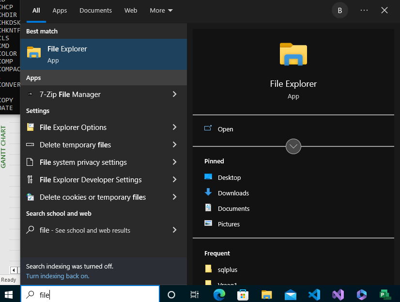
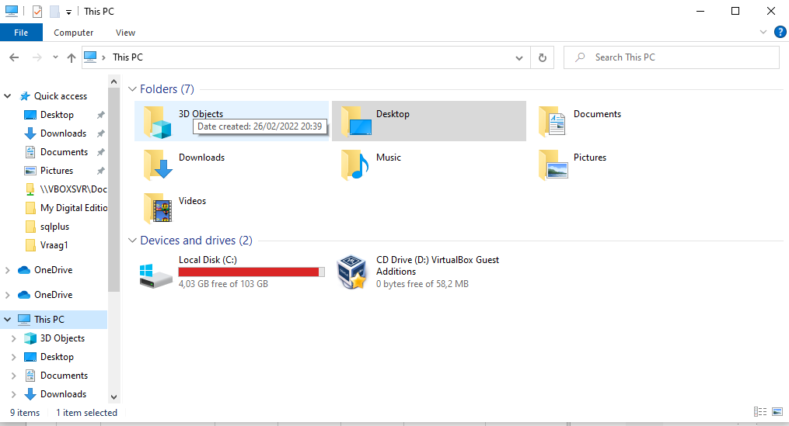
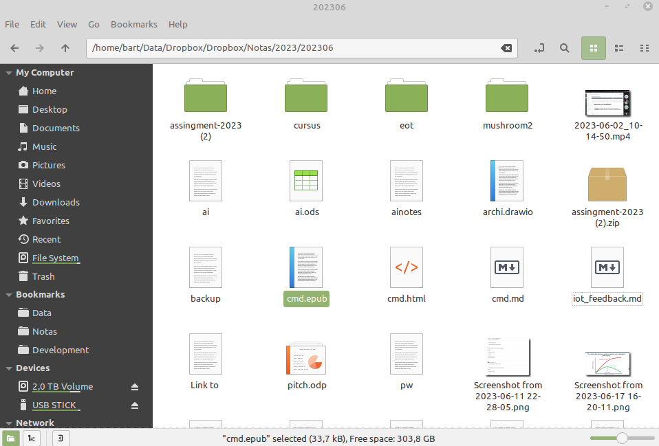
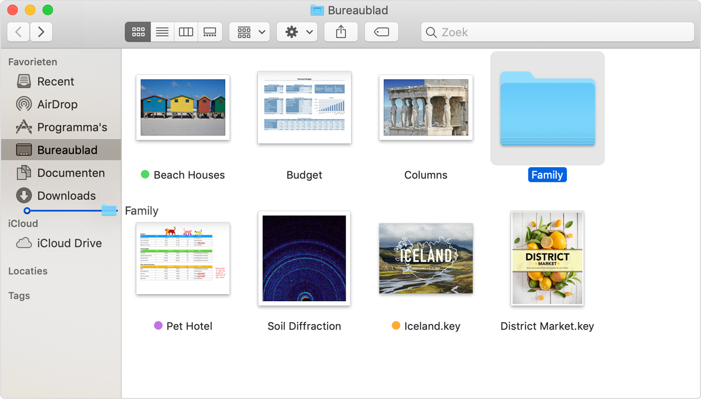

#### Windows layout

~~~
C:\ ──+
      ├── Program Files
      ├── Program Files (x86)
      ├── Users
            └── student
            └── bart
      ├── System
      ├── System32
      ├── SysWOW64
      ...
D:\ ──+
      ├── een_folder
      ...
~~~

#### Linux layout

~~~
/ ──+
    ├── bin -> usr/bin (link)
    ├── boot
    ├── dev
    ├── etc
    └── home
          └── student
          └── bart
    ├── media
    ├── mnt
    ├── opt
    ├── proc
    ├── root
    ├── run
    ├── sbin -> usr/sbin (link)
    ├── srv
    ├── sys
    ├── tmp
    └── usr
    └── var
    ...
~~~

## Werken met een "File Explorer" (verkenner)

Deze bestanden kan je via een "fileexplorer" bekijken en openen.

### Windows "File Explorer"

De Windows kan je deze openen via het menu:

En kan je via deze explorer navigeren naar directories en bestanden openen

### Linux "File Explorer"

Op Linux heb je - afhankelijk van je distributie - vergelijkbare tools.  
Hieronder zie je op Linux Mint het gebruik van Nemo-fileexplorer

### Mac OSx "File Explorer" (Finder)

Mac OSx gebruik het dan weer het reeds geïnstalleerde **Finder**

#### MacOSx

#### Structuur van commando's