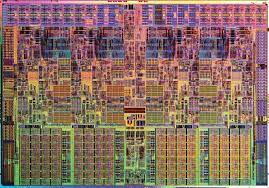

# Bits & Bytes

De kans is groot dat je - als software developer (of toekomstige) - dat je al van bits & bytes hebt gehoord.  
Denk hierbij maar aan:

* De grootte van een file of opslagmedium (kilobytes, megabytes, ...)
* Processoren van 64 bit
* Een RAM-geheugen van 8 gigabyte
* De codering van IP-adressen
* RGB-kleurensysteem
* Hashing en ecrypties die op bit-niveau spelen
* ...

## Computerhardware kent enkel bits en bytes

Om te weten waarom bits & bytes zo belangrijk zijn moeten we gaan kijken naar computerhardware.  

* TODO: transistors als schakelaars
* Von Neumann...

## Getallenstelsels

### Cijfers vs getallen

De eenvoudigste **manier** om **bits** te **begrijpen** is door ze te **vergelijken** met iets dat je **kent**, namelijk **cijfers**.  

Een (decimaal) **getal** bestaat uit verschillende **cijfers** die numerieke waarden **tussen 0 en 9** kan bevatten.  
Deze cijfers worden dan gecombineerd om grotere getallen te creëren.  

### Volgorde vs waarde

Bijvoorbeeld het getal **1234** bestaat uit **4** **cijfers**: **1, 2, 3 en 4**.  
De waarde die dit getal heeft wordt bepaald door dat de **volgorde** van deze cijfers.  

Zo weten we dat **3124** **groter** is dan **1234** **ondanks** het feit dat dit uit **dezelfde cijfers** bestaat.

### Decimale getallen-stelsel

Dit kan je wiskundig heel gemakkelijk uitrekenen door elk **cijfer** uit een **getal** te vermenigvuldigen
met een **macht van 10**.

~~~
  (1 * 1000) + (2 * 100) + (3 * 10) + (4 * 1)
=    1000    +    200    +    30    +    4     =   1234

  (3 * 1000) + (1 * 100) + (3 * 10) + (4 * 1)
=    3000    +    100    +    20    +    4     =   3124
~~~

Je gebruik hiervoor machten van 10:

* het meest **rechtse cijfer** wordt vermenigvuldigd met **10** tot de **0de macht**
* het **2de van rechts** 10 met de **1ste macht**
* het 3de met de 2 macht
* ...

Vandaar dat we het getallenstelsel decimaal noemen.  
De **deci** in decimaal betekent **10**, elke **positie** - van rechts naar links - stelt een
hogere macht van 10 voor

## Van 10 naar 8 vingers

Bovenstaande zou nog in je comfortzone moeten zitten uit het lager en middelbaar onderwijs...  
Decimale getallen zijn voor ons ook heel logisch, de mens heeft leren werken met het decimale
tallenstelsel gezien wij 10 vingers hebben.

Stel dat we - zoals de **4 vingers** zouden hebben zouden we bijvoorbeeld met een **8-tallig tallenstelsel** hebben

En zouden we als volgt tot de waarde komen van onze getallen

~~~
  (1 * 8^3) + (2 * 8^2) + (3 * 8^1) + (4 * 8^0)
=    512    +    128     +     24     +    4    =   668 (ipv 1234 decimaal)

  (3 * 8^3) + (1 * 8^2) + (2 * 8^1) + (4 * 10^0)
=    1536    +    64     +    16      +    4    =  1620 (ipv 3124 decimaal)
~~~

Met een andere getallenstelsel krijgen we dus een andere waarde.  
In het geval van het 8-tallig (Simpson-)getallenstelsel is de eigenlijke waarde kleiner...

## Computers hebben echter maar 2 vingers...

Computers werken echter **niet** met **10 of 8** (vingers) als **basis** maar met een **2-tallig getallenstelsel**.  
Dit benoem we ook wel het **binaire getallenstelsel**.  

Waarom heeft een computer maar 2 vingers om te tellen?  
Dit is omdat dat alle hardware simpel gezegd **elektronische schakelaars** zijn, die enkel **aan** of **uit** kunnen zijn.  

De **geheugens** van een **computer**, zoals een harde schijf, ram-geheugen, het cache-geheugen van een processor (eender welke vorm van memory..) bestaat eigenlijk uit miniscuul kleine schakelaars (of transistoren) die 1 of 0 kunnen zijn (eigenlijk +- 1 000 000 000 van die schakelaars).

maw alle getallen (alle data) die je in je programma berekent zal worden opgeslagen als een sequentie van 0 en 1-tjes

> Nota: technisch gezien zou je computerhardware kunnen maken die tot 10
> zou kunnen tellen ipv 2 maar dit zou zeer complex en duur worden...

### Binaire getalstelsel

Hoe werkt dit binaire getallenstelsel nu?  
**ipv** met **10 vingers** te tellen tellen we er met maar **2 vingers**

Waar we dus met **10 cijfer-symbolen** werkten tussen **0 en 9**, werkte een computer enkel met 2 symbolen **0 en 1**.  
**Bijvoorbeeld** het getal 1011 **vertaalt** zich naar een waarde als volgt:

~~~
  (1 * 2^3) + (0 * 2^2) + (1 * 2^1) + (1 * 2^0)
=    8    +       0     +     2     +    1      =   11 (decimaal)
~~~

> Weetje: het woord bit is eigenlijk de afkorting van **b**inary dig**it** 
> waar digit voor cijfer staat...

### Bytes groeperen bits...

**Bits** worden zelden **alleen** **gebruikt** binnen **computers** en programma's.  
Ze zijn bijna altijd gebundeld in **8-bits groepjes**, en deze verzamelingen noemen we **bytes**...

Dit maakt het **gemakkelijker** om **grotere** **getallen** te vormen en hardware te maken die op
groepen van bits te werken.  

Waarom 8, dat is iets dat de afgelopen 70 jaar zo geevolueerd is in computer hardware...
Hoe ziet zo'n byte eruit, heel simple een aanéénschakeling van 8 bits

~~~
1101 1010
~~~

## Waarom is dit belangrijk

TODO

## Waarom heb je bits en bytes nodig?

* Files (ascii, UTF)
* Netwerk (IP-)adressen
* RBG-codes

## Tallenstelsels

## Hardware & logischepoorten