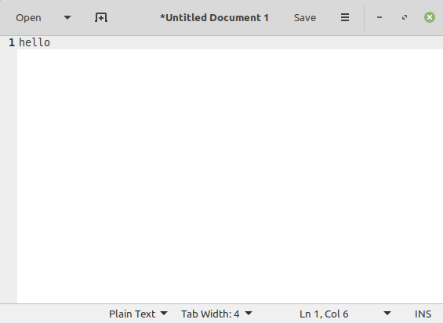
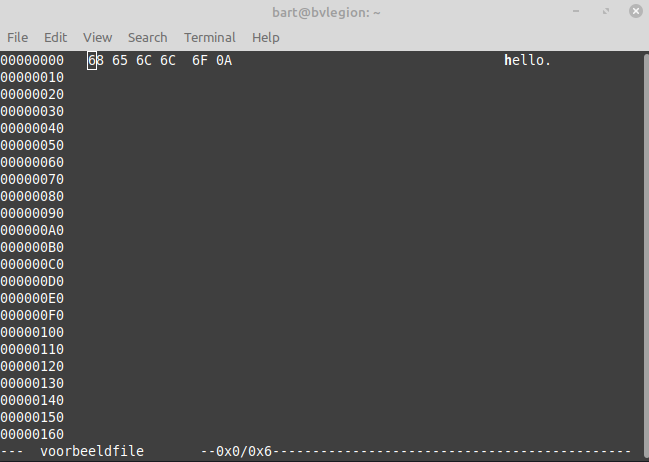

# Bits & Bytes

Doel van dit hoofdstukje is wat **duiding** te geven **wat bits en bytes** zijn
en wat je er mee kan of moet aanvangen of software ontwikkelaar.

## Om te starten, wat zijn bits en bytes?

**Vooraleer** te kijken **hoe** we met **bits en bytes** **werken** waar hebben we het over 
als we over bits & bytes spreken.

### Wat zijn bits?

Intern gebruikt je computer **bits** om informatie **digitaal** **op te slaan**.  
Alle hardware op je computer **CPU**, **geheugen**, **harde schrijven**, flashgeheugen,... werken op dit niveau

Een bit is eigenlijk een samentrekking van **b**inary dig**it**, wat zich letterlijk vertaald **binair cijfer**.
maw heb betreft een cijfer dat enkel 2 waardes kan hebben, namelijk **0 of 1**.

### Computer(geheugen) -> rijen van bits

Alle soorten **computergeheugen** - of het nu een harde schijf, RAM-geheugen, cache, ... zijn -
zijn (aan de basis) **rijen/aanschakelingen** van (zeer veel) **bits** (miljarden).  

Een computer is dus niet meer of minder allemaal kleine schakelaartjes die 0 of 1 kunnen zijn
zoals je hieronder ziet.  

~~~
+---+---+---+---+---+---+---+---+---+---+---+---+---+---+---+---+
| 0 | 1 | 0 | 1 | 1 | 0 | 0 | 0 | 0 | 0 | 0 | 0 | 1 | 0 | 1 | 0 | ...
+---+---+---+---+---+---+---+---+---+---+---+---+---+---+---+---+
~~~

Rond al die 0- en 1-tjes heb je dan een hardware dat (reken en logische) bewerkingen doet op die rij van bitjes.  
De **CPU** van je computer (of eender welk digitaal toestel) verwerkt dan en houdt al zijn informatie bij in die lange rij van bits.  

~~~
                             +-----+
                             | CPU |
                             +--+--+
                                |
                                v
+---+---+---+---+---+---+---+---+---+---+---+---+---+---+---+---+
| 0 | 1 | 0 | 1 | 1 | 0 | 0 | 0 | 0 | 0 | 0 | 0 | 1 | 0 | 1 | 0 | ...
+---+---+---+---+---+---+---+---+---+---+---+---+---+---+---+---+
~~~

### Computerorganisatie

#### Computerorganisatie -> groeperen en adresseren van bits

Als ik je vertel dat computerhardware **enkel** met in **bits** werkt is dat maar een **half verhaal**.  
**Bits** worden zelden **alleen** **gebruikt** binnen **computers** en programma's.  

Er zijn namelijk 2 grote challenges als je werkt met bits:

* **bits** zijn te **klein** om met te **werken**  
  Bij voorkeur ga je dit proberen te **groeperen** in grotere stukken om de data 
  gemakkelijker te berekenen, bewerken, op te halen of te bewaren
* Je moet geheugen kunnen **adresseren** (zoals je een boek indexeert met pagina's en hoofstukken) om data terug te vinden

#### Computerorganisatie -> bits groeperen (per 8) in bytes

Hoe pakt men dit nu aan in een computer, een 1ste deel van de oplossing is

Die **rij van bits** wordt bijna altijd **gebundeld** in **8-bits groepjes**, en deze **verzamelingen** noemen we **bytes**...

Dat groeperen in bytes maakt het voor de CPU/processor **gemakkelijker** om data te gaan groeperen in die gigantische 
reeks van bits. 

#### Computerorganisatie -> adresseren van bytes (gegroepeerde bits)

Het **werkgeheugen** of RAM is technisch gezien een hele rang **rij van bits** dan gegroepeerd in **adresseerbare bytes**.  
De processor/CPU kan deze data bereiken via deze adressen

~~~
                             +-----+
                +------------+ CPU +------------+
                |            +-----+            |
                |                               |
                V                               V
         Byte op adres 0                 Byte op adres 1
                |                               |
+---------------+---------------+---------------+---------------+
|                               |                               |
+---+---+---+---+---+---+---+---+---+---+---+---+---+---+---+---+
| 0 | 1 | 0 | 1 | 1 | 0 | 0 | 0 | 0 | 0 | 0 | 0 | 1 | 0 | 1 | 0 | ...
+---+---+---+---+---+---+---+---+---+---+---+---+---+---+---+---+
~~~

In het voorbeeld hierboven heb je:

* Op **adres 0** => een byte met de waarde **0101 1000** of 0x58 (hexadimaal) of 88 (decimaal)
* Op **adres 1** => een byte met de waarde **0000 1010** of 0x0A (hexadimaal) of 10 (decimaal)

Elk van die bytes kan dan voorgesteld worden als een getal tussen 0 en 255 (anders gezegd 2^8 of 256 mogelijke getallen)

> Geen zorgen: We leggen verder in het document uit wat hexadecimaal is en hoe je die 0- en 1-tjes moet begrijpen

#### Programma's, werkgeheugen en bytes

Deze **groepering** en **adressering** van **bytes** zijn dus de basisprincipes achter de werking van 
eender welke computer.  

Aan de basis gaat een computer de **programma**'s die je schrijft uitvoeren door constant **bytes** (of groepen van bytes)
te **lezen** en weg te **schrijven** naar werkgeheugen of RAM (en ondertussen berekeningen op uit te voeren).  

Stel dit **extreem veréénvoudigde voorbeeld**, je hebt een programma dat 2 bytes met elkaar optelt.  

~~~cs
...
char a = 88;
char b =  5;
char c = a + b;
...
~~~

> Nota: Een char is C# een cijfer met de grootte van een bytes

**Wat** gebeurt er nu met een computer als je dit **programma** compileert en uitvoert?

* Eerst worden variabele a en b worden ergens met hun waarde in het geheugen geplaatst  
  (intern wordt a en b vertaald naar een adres)
  * Variabele a wordt bijvoorbeeld op adres 1 gezet (kan ook adres 545465466 zijn maar voor de éénvoud)
  * Variabele b wordt bijvoorbeeld op adres 2
* Stap 1 en 2: De **waardes** van **adres 0 en 1** opvragen
* Stap 3: Het resultaat van beide wordt **opgeteld** 
* Het **resultaat** **opslagen** in de byte met adres **2** (variabele c)

~~~
+-----------+     STAP 1      +---+------------+
|           +<----------------+ 0 | 0101 1000  |
|   CPU     |     STAP 2      +----------------+
|           +<----------------+ 1 | 0000 1010  |
+-----+-----+     STAP 3      +----------------+
      +---------------------->+ 2 | 1100 0010  |
                              +----------------+
                              | 3 |            |
                              +----------------+
                              | 4 |            |
                              +---+------------+
                                 ...
~~~

Hou rekening er mee, dit is natuurlijk heel **veréénvoudigd**, **adressen** op je computer gaan tot in de **miljarden**.  
Een **gigabyte** is gelijk aan** 1.073.741.824** (oftewel 2^30).  
Ook gaat een CPU in werkelijkheid gaat meerdere bytes tegelijk (4 tot 8) ophalen (afhankelijk van je databus). 

> *Wist je trouwens:*  
> **RAM** staat trouwens voor **Random Access Memory**.  
> Het woord **Random** staat daarin voor het feit dat
> je eender welke geheugencel (met grootte van een byte) 
> even snel kan ophalen losstaande van welk (random) adres
> het heeft.  
> Zo zal byte 1.000.000 even snel opgehaald worden als 
> byte 1

#### Conclusie computerorganisatie: bytes zijn de boekhouding van een computer

Het **belangrijkste** om te weten is dat een **computer** zijn **boekhouding** altijd bijhoudt in **adressen** van **bytes** voor alles wat opslag is.  
Ook files, computerprogramma's, ... moet je bekijken in **bytes** (zeker in de tooling en debugging)

> Domme vragen bestaan niet:
> **Waarom is 1 byte gelijk aan 8 bits?**  
> dat is iets dat de afgelopen 70 jaar zo geevolueerd is in computer hardware...  
> Het werkt gewoon heel efficient omdat je gemakkelijk kan omrekenen van bit naar **hexadecimale** getallen zoals
> je zo dadelijk zal zien...

## Moet ik echt weten wat bits en bytes zijn als softwareontwikkelaar?

Eénvoudig gezegd **JA** (en nog eens JA)? als softwareontwikkelaar (of toekomstige) kom je regelmatig bytes (of soms bits) tegen.  

### Coderingen

Het kunnen **werken** met **bytes** en **hexidecimale** getallen zoals

* De **codering** van **IP-adressen**
* **ASCII**- en UTF8 voor codering van tekstbestanden en strings
* **RGB**-kleurensysteem
* **Hashing** en **ecrypties** die op bit-niveau spelen
* **Geheugenadressen**
* ...

### Debuggen en analyseren van programma's

Je bent aan het **programmeren/debuggen**:

* De **identificatie** van een **object** tijdens het **debuggen** (707 tem 709 zijn geheugenlocaties...)
* De **inhoud** van een **String** is ook maar een **array van bytes** (100, 101, 98, 117, 103, 103, 101, 110 is een array van bytes)
* **Exit**-codes binnen **programma's**
* ...

### Embedded programmere en operating systemen

In sommige takken van programmeren is het nog belangrijk te begrijpen en om te gaan met software.  

Wanneer je embedded software schrijft of drivers maakt om met specifieke hardware (peripherals) 
moet je van je software zoe goed als rechtstreeks communiceren met je hardware.  

Die hardware zal dan ook enkel bits en bytes verstaan...

### bits en bytes als meetéénheden (voor geheugen)

Denk hierbij maar aan het **begrijpen** van **groot- en meetéénheden** zoals:

* De **grootte** van een **file** of opslagmedium (kilobytes, megabytes, ...)
* **Processoren** van **32 bit vs 64 bit**
* Een RAM-geheugen van **8 gigabyte**
* ...
 
Deze grootheden zijn **multiplicators van bytes met machten van 2** (niet met duizendtallen) zoals je ziet hieronder  

| Hoeveelheid          | Grootheid | Afkorting |
|----------------------|-----------|-----------|
| 2^10 = 1,024 × 10^3  | kilobyte  | kB        |
| 2^20 ≈ 1,049 × 10^6  | megabyte  | MB        |
| 2^30 ≈ 1,074 × 10^9  | gigabyte  | GB        |
| 2^40 ≈ 1,100 × 10^12 | terabyte  | TB        |
| 2^50 ≈ 1,126 × 10^15 | petabyte  | PB        |
| 2^60 ≈ 1,153 × 10^18 | exabyte   | EB        |
| 2^70 ≈ 1,181 × 10^21 | zettabyte | ZB        |
| 2^80 ≈ 1,209 × 10^24 | yottabyte | YB        |

We **benaderen** deze met de **som** van  **machten** van **2^10** zoals je in de tabel hierboven ziet:

* Een **kilobyte** is **1.024** ipv 1.**000**
* Een **gigabyte** is **1.073.741.824** ipv **1.000.000.000**
* ...

Dit kan een detail lijken maar hoort toch tot de **essentiele kennis** van een softwareontwikkelaar.

> **Oefening:**  
> Reken uit als oefening hoe groot dit document is in bytes en bits...

### bits en bytes in netwerk snelheid

Als men spreekt over **bandbreedte** en **download-upload snelheden** spreekt met soms over mpbs, gpbs ...  of we het aantal bits per seconde 
dat een netwerk doorduwt.  

In dat geval spreken we echter over **1000-tallen ipv 2^10**:

* **kbps** staat voor **1.000 bits/sec**
* **mbps** staat voor **1.000.000 bits/sec**
* **gbps** staat voor **1.000.000.000 bits/sec**
* ...

## Waarde van (bits en) bytes

Computers en software voeren berekenen, coderen, decoderen, ... met bytes.  

We hebben tot nu gezien waarom er bits en bytes bestaan en we hebben min of meer een idee wat ze zijn.    
Om echter de waardes er van te decoderen en te berijpen moeten we iets verstaat over getallenstelsels.

### Getallenstelsels

De eenvoudigste **manier** om **bits** te **begrijpen**, is door ze te **vergelijken** met iets dat je **kent**, 
namelijk de gewone decimale **cijfers** die we kennen.

Om te kunnen werken met decimale cijfers hebben het **decimale getallenstelsel** moeten leren.  
Zo'n getallenstelsel is het geen dat onze cijfers vertalen naar een **waarde**

#### Cijfers vs getallen

Het concept van een getallenstelsel waarschijnlijk vrij **abstract**...  
Omdat te begrijpen moeten we starten met het begrijpen van het **verschil** tussen een **getal** en **cijfer**

Een (decimaal) **getal** bestaat uit verschillende **cijfers** die numerieke waarden **tussen 0 en 9** kan bevatten.  
Deze cijfers worden dan gecombineerd om grotere getallen te creëren.  

Bijvoorbeeld bij 

* is het **getal** **1234** 
* en bestaat dit uit **4** **cijfers**: 1, 2, 3 en 4.  

#### Volgorde van cijfers vs waarde van getal

De waarde die dit **getal heeft** wordt bepaald door:

* De **waarde** van deze **cijfers** zelf  
  (9 is groter dan 1)
* Maar ook **vooral** ook de **volgorde** van deze cijfers  
  (de 2 in 2000 is van grotere waarde dan de 2 in 20).  

Zo weten we dat **3124** **groter** is dan **1234** **ondanks** het feit dat dit uit **dezelfde cijfers** bestaat.

#### Decimale getallen-stelsel

De waarde van een decimaal getal kan je wiskundig heel gemakkelijk 
uitrekenen door elk **cijfer** uit een **getal** te vermenigvuldigen
met een **macht van 10**.

~~~
  (1 * 1000) + (2 * 100) + (3 * 10) + (4 * 1)
=    1000    +    200    +    30    +    4     =   1234

  (3 * 1000) + (1 * 100) + (3 * 10) + (4 * 1)
=    3000    +    100    +    20    +    4     =   3124
~~~

Je gebruik hiervoor machten van 10:

* het meest **rechtse cijfer** wordt vermenigvuldigd met **10** tot de **0de macht**
* het **2de van rechts** 10 met de **1ste macht**
* het 3de met de 2 macht
* ...

Vandaar dat we het getallenstelsel decimaal noemen.  
De **deci** in decimaal betekent **10**, elke **positie** - van rechts naar links - stelt een
hogere macht van 10 voor

#### Van 10 vingers...

**Decimale getallen** zijn voor ons ook heel **logisch**, de mens heeft leren werken met het decimale
tallenstelsel gezien wij **10 vingers** hebben.

#### ...naar 8 vingers

Stel dat we - zoals de **4 vingers** zouden hebben zouden we bijvoorbeeld met een **8-tallig tallenstelsel** hebben

En zouden we **als volgt** tot de **waarde** komen van onze **8-tallig getallen** (2 * 4 vingers)

~~~
  (1 * 8^3) + (2 * 8^2) + (3 * 8^1) + (4 * 8^0)
=    512    +    128     +     24     +    4    =   668 (ipv 1234 decimaal)

  (3 * 8^3) + (1 * 8^2) + (2 * 8^1) + (4 * 10^0)
=    1536    +    64     +    16      +    4    =  1620 (ipv 3124 decimaal)
~~~

In het 10-tallig stelsel werkten we met een **basis** van 10, elke positie (van rechts naar links)
was een macht van 10 hoger (1 -> 10 -> 100 -> 1000 -> ...)  

In ons nieuw **8-tallig stelsel** werken we echter met een **basis** van **8**.  
Elke positie gaat dus vermenigvuldigd worden met een hogere macht van 8
(1 -> 8 -> 64 -> 512)

Met een **andere getallenstelsel** krijgen we dus een **andere waarde**!!!  
In het geval van het **8-tallig (Simpson-)getallenstelsel** is de eigenlijke waarde kleiner...
Dit is ook logisch want er zijn **minder getallen of symbolen** beschikbaar voor elke positie van het **cijfer**

### Computers hebben zelfs maar 2 vingers (1 vinger aan elke hand)

Nu dat we (min of meer) begrijpen wat een getallenstelsel is (en dat je ook andere getallenstelsel hebben dan het decimale)
kunnen we de overstap maken naar binaire getallen (die maar 2 vingers hebben)

Computers werken echter **niet** met **10 of 8** (vingers) als **basis** maar met een **2-tallig getallenstelsel**.  
Als we werken met bits (0 of 1) benoemen we ook wel het **binaire getallenstelsel**.  

Waarom heeft een computer maar 2 vingers om te tellen?  
Dit is omdat dat alle hardware simpel gezegd **elektronische schakelaars** zijn, die enkel **aan** of **uit** kunnen zijn.  

De **geheugens** van een **computer**, zoals een harde schijf, ram-geheugen, het cache-geheugen van een processor (eender welke vorm van memory..) bestaat eigenlijk uit miniscuul kleine schakelaars (of transistoren) die 1 of 0 kunnen zijn (eigenlijk +- 1 000 000 000 van die schakelaars).

maw alle getallen (alle data) die je in je programma berekent zal worden opgeslagen als een sequentie van 0 en 1-tjes

> Nota: technisch gezien zou je computerhardware kunnen maken die tot 10
> zou kunnen tellen ipv 2 maar dit zou zeer complex en duur worden...

#### Binaire getalstelsel (of hoe te tellen met 2 vingers)

Hoe werkt dit binaire getallenstelsel nu?  
**ipv** met **10 vingers** te tellen tellen we er met maar **2 vingers**

Waar we dus met **10 cijfer-symbolen** werkten tussen **0 en 9**, werkte een computer enkel met 2 symbolen **0 en 1**.  
**Bijvoorbeeld** het getal 1011 **vertaalt** zich naar een waarde als volgt:

#### Binair naar decimaal (van 2 naar 10 vingers)

Als we kijken naar de vorige getallenstelsels gebruiken we een basis om de waarde in te schatten:

* Bij het **10-tallig** stelsel werk je met 10 symbolen (0 tem 9) en **machten** van **10**
* Bij het **8-tallig** stelsel werk je met 8 symbolen (0 tem 7) en **machten** van **8**

Werken met binaire getallen volgt **hetzelfde principe**:

* Je werkt met 0 en 1 als symbolen
* Maar met een **basis** van **2**

Stel bijvoorbeeld je wil de **waarde** te weten komen van het binaire getal **1011**.  
In de berekening hieronder stap je dezelfde stappen als eerder toe maar met een **basis** van **2**:

~~~
  (1 * 2^3) + (0 * 2^2) + (1 * 2^1) + (1 * 2^0)
=    8    +      0     +     2     +     1      =   11 (decimaal)
~~~

Je **rekent** dus **om** naar een (decimale) **waarde** bits en bytes om te zetten van binair door decimaal door:

* De waarde **0** of **1** van **elk getal**
* **Vermenigvuldigen** met een **macht van 2**
* Van **links naar rechts** telkens een **macht hoger** (startende bij 0)

#### Decimaal naar binair (van 10 naar 2 vingers)

**Moeilijker** is een **decimaal** getal **om** te **zetten** naar een **binaire** representatie.  
Om dit te doen wordt meestal het **volgende algoritme** toegepast:

* **Deel** het getal door **2** iteratief/herhaaldelijk
* Per **iteratie**
  * Hergebruik **gehele quotiënt** op voor **een volgende iteratie**.
  * Gebruik de **rest** op voor het binaire cijfer.
* **Herhaal** de stappen totdat het **quotiënt** gelijk is aan **0**.
* Het **resultaat** is het **uitschrijven** van de **bits** vanachter te beginnen

Als je bijvoorbeeld 11 wil omzetten

| Delen  door 2 | Quotiënt | Rest | Bit # |
|:-------------:|:--------:|:----:|:-----:|
| 11/2          | 5        | 1    | 0     |
| 5/2           | 2        | 1    | 1     |
| 2/2           | 1        | 0    | 2     |
| 1/2           | 0        | 1    | 3     |

Let wel het **resultaat** moet worden omgedraaid 13 is **niet** gelijk aan **1101** maar zal **1011** zijn

> Nota:  
> Bemerk dat je dit algoritme ook kan gebruiken om om te rekenen
> naar andere getallenstelsels.  Als naar een 8-tallig stelsel
> wil omrekenen deel je door 8 ipv 2

## Hexadimale representaties

We hebben zonet gezien dat het **moeilijk** is om te rekenen van **binair** naar **decimaal**.  
In de praktijk worden bytes (computerdata) echter niet **binair** **voorgesteld** maar 
gebruiken we eerder een **hexadecimale** voorstelling.  

### Hexadecimaal getallenstelsel

**Hexadecimaal** is een **16-tallig getallenstelsel** en bestaat uit de volgende cijfers: van 1 tem 10 en van A tem F.  
In onderstaande tabel zie je een mapping van de decimale getallen (base 10) naar hexadecimaal (base 16) naar binair (base 2)

|base 10  |base 16 | base 2 |
|---------|--------|--------|
|0        |0       |    0000|
|1        |1       |    0001|
|2        |2       |    0010|
|3        |3       |    0011|
|4        |4       |    0100|
|5        |5       |    0101|
|6        |6       |    0110|
|7        |7       |    0111|
|8        |8       |    1000|
|9        |9       |    1001|
|10       |a       |    1010|
|11       |b       |    1011|
|12       |c       |    1100|
|13       |d       |    1101|
|14       |e       |    1110|
|15       |f       |    1111|

Een **hexadecimaal** getal omzetten naar **decimaal** is niet zo heel moeilijk.  
Je vermenigvuldigt elke positie met een macht van 16:

Het getal **AB** hexadecimaal bijvoorbeeld kan je dan omrekenen als volgt met als resultaat **171** decimaal

~~~
0xB * 16^0 = 11 * 1  =  11
0xA * 16^1 = 10 * 16 = 160
                     + ---
                       171
~~~

### Notaties van hexadecimale getallen

Om het onderscheid te maken tussen decimale en hexadecimale getallen gebruik men meestal - zeker in programmeertalen - gebruik van een prefix.

In de meeste programmeer talen prefixen we bijvoorbeeld hexadecimaal getal met **0x**.  
In onderstaande snippet bijvoorbeeld initialiseren we variabele **a** met het **hexadecimale**
**getal 58** en variabele **b** met een decimaal getal **88**

~~~cs
...
char a = 0xA8; 
char b = 168; 
// Beide variabelen zijn gelijk in waarde
Debug.Assert(a == b); 
...
~~~

Ik gebruik in het voorbeeld **Assert** om het programma te laten crashen in geval 
de vergelijking niet correct zou zijn.  
De zelfde notatie wordt trouwens ook gebruikt in ander talen zoals Python hieronder...

~~~python
...
a = 0xA8
b = 168
# Beide variabelen zijn gelijk in waarde
assert(a == b)
...
~~~

### Hexadecimaal vs 4 bits

Zoals je misschien al kan gezien hebben lopen de **waardes** van een **hexadecimaal** getal
**gelijk** met die van exact van **4 bits**.  
Het **laagste hexadecimaal** getal **0x0** is **gelijk** aan **0b0000** en het **hoogste 0xF** is gelijk aan **0b1111**.

Dit zorgt ervoor dat een **directe** **conversie** kan doen van **binair** en **hexadecimaal** (op voorwaarde dat je de tabel hierboven vanbuiten kent...)

**Bijvoorbeeld** **"1010 0011 1110 0001"** kan **direct** mappen naar het hexadecimale equivalent **"A3E1"** en omgekeerd.  

### Hexadecimaal en bytes (en nibbles)

Zo'n **groepje** van **4 bits** - dat je kan voorsttellen met een hexadecimaal getal - noemen we ook wel een **nibble**.  
Een **byte** bestaande uit **exact 2 nibbles** kan je dan ook **exact** **mappen** naar een hexadecimaal representatie.

Een byte zal dan gaan van 0x0 naar 0xFF (255 decimaal of 1111 1111 binair).  
maw Een byte kan altijd **exact** worden voorgesteld als **2 hexadecimale getallen**.  

### Hexadecimaal is gemakkelijker om met te werken van binair

Je kan dus eigenlijk heel gemakkelijk **converteren** van de taal van de machine (bits) naar een leesbaar en bruikbaar getal.  
Als je bijvoorbeeld een integer van 32 bits hebt kan je moeillijk werken en rekenen met binaire getallen.  

Als bijvoorbeeld een binaire representatie van **32 bits** uitschrijft in **binair**: 

* 1010 1000 1011 1111 0001 1000 1110 1111  

kan je deze **veel gemakkelijker** voorstellen als **hexadecimaal**

* A8BF18EF

Standaard zal je in alle tooling waar je bit-manipulatie moet doen eerder werken 
met **hexadecimale** representaties van bytes ipv **binaire** representatie.

### Conclusie: Hexadecimaal is gemakkelijker als representatie voor bytes

Waarom werken we nu met Hexadecimale representaties?  
In essentie zijn er 2 belangrijke reden:

* Het **leest en schrijft** gemakkelijker dan binaire notatie (zie hierboven)
* Er is een **gemakkelijke mapping** met **bits** wat je **niet** hebt bij **decimale getallen**

Laten we dit illustreren met als voorbeeld **ipv6-adressering**.

#### Gemakkelijke notatie voor bytes

Zo'n een IPV6-adres is een getal bestaande uit 16 bytes of 128 bits.  
Gegeven bijvoorbeeld een **ipv6-adres** met als waarde **2001:0db8:85a3:0000:1319:8a2e:0370:7344**.  

Stel dat je dit zou moeten uitdrukken in een **binaire representatie** zou je een grote
blok krijgen zoals **hieronder** voorgesteld: 

~~~
0100 0000 0000 0001 0000 1101 1011 1000
1000 0101 1010 0011 0000 0000 0000 0000
0001 0011 0001 1001 1000 1010 0010 1110
0000 0011 0111 0000 0111 0011 0100 0100
~~~

Het wordt moeilijk te werken met die bits als je deze wil ingeven in een configuratie van 
bijvoorbeeld een operating system, een router, ...

#### Waarom geen decimaal representatie gebruiken?

In het kader van "er zijn geen domme vragen" zou je zou natuurlijk kunnen argumenteren,
waarom geen 

Je zou **2001:0db8:85a3:0000:1319:8a2e:0370:7344** kunnen **decimaal** kunnen voorstellen als
**42540766452641154073116346738896040772** bijvoorbeeld?

Het grote voordeel van hexadecimale representaties was - zoals eerder vermeld - 
de directe(re) mapping naar de bits.

~~~
  2    0    0    1    0    d    b    8
0100 0000 0000 0001 0000 1101 1011 1000
  8    5    a    3    0    0    0    0 
1000 0101 1010 0011 0000 0000 0000 0000
  1    3    1    9    8    a    0    e
0001 0011 0001 1001 1000 1010 0010 1110
  0    3    7    0    7    3    4    4 
0000 0011 0111 0000 0111 0011 0100 0100
~~~

Dit wordt duidelijk bij **bijvoorbeeld** wanneer men bij **ip-adressen** wordt er 
gebruik gaat maken van **bitmasks** om na te kijken of een IP-adres 
tot een **zelfde** **network** behoort of **range** hoort.  

In deze techniek ga je bekijken naar de 1ste n bytes (of bits) om te weten of ip-adres tot het
zelfde netwerk behoort.

Als je bijvoorbeeld beslist dat alle hosts met dezelfde 1ste **14 bytes**  tot het zelfde netwerk behoren
zal **2001:0db8:85a3:0000:1319:8a2e:0370:7344** behoren tot het netwerk **startende met**
**2001:0db8:85a3:0000:1319:8a2e:0370**

~~~
masker: 2001:0db8:85a3:0000:1319:8a2e:0370
IP 1:   2001:0db8:85a3:0000:1319:8a2e:0370:7344
IP 2:   2001:0db8:85a3:0000:1319:8a2e:0370:1111
IP 3:   2001:0db8:85a3:0100:1319:8a2e:0370:1381
                        ^
                        +---- IP 3 is verschillend 
~~~

Zoals je ziet in het voorbeeld hierboven kan je na een 
korte vergelijking zien welke host tot het zelfde netwerk
behoort.

Anderzijds kan de computer en software hier heel efficient
op opereren gezien er enkel moet gemapt worden op de bits
rechtstreeks zonder al te veel berekening...

Een zelfde vergelijking en of structurering zou je niet kunnen
maken met decimale getallen.

## Toepassingen met bits, bytes en hexadecimale getallen

Hexadecimaal wordt letterlijk **overal gebruikt** in IT-toepassingen.

Naast netwerknotaties (ipv6 en MAC bijvoorbeeld) wordt het ook zeer veel gebruikt in security 
en alle soorten encoderingen en adresseringen zoals:

* De **kleur** oranje #ff8500 
* De **ascii-code** voor hello zijnde 68 65 6C 6C 6F
* Een **geheugenadres** tijdens het debuggen van 0xFE89AAOE
* ...

### ASCII en file-encoderingen

Een praktisch voorbeeld is de opbouw van een tekst file.  

Stel nu dat je met een teksteditor zoals notepad (geen tekstverwerker zoals Word voor alle duidelijkheid)
een tekstfile maakt met de inhoud hello...

Als we nu gaan kijken naar een tool om de bytes te bekijken waaruit een file bestaat via een tool zoals
hexedit op Linux

> Als je dit op Windows wil proberen gebruik HxD (https://mh-nexus.de/en/hxd/) voor Windows  
> Voor Mac kan je Hex Fiend gebruiken (https://hexfiend.com/)

Deze file bestaat uit de bytes **68 65 6C 6C 6F 0A**  
Elke byte komt overeen met een byte:

* 68 -> h
* 65 -> e
* 6C -> l
* 6C -> l
* 6F -> o

De laatste komt overeen met een onzichtbaar karakter dat we een linefeed 
noemen en het einde van een lijn markeert.

De mapping van bytes naar een printbaar karakter noemen we **ASCII**.

~~~
00 NUL  10 DLE  20    30 0  40 @  50 P  60 `  70 p 
01 SOH  11 DC1  21 !  31 1  41 A  51 Q  61 a  71 q 
02 STX  12 DC2  22 "  32 2  42 B  52 R  62 b  72 r 
03 ETX  13 DC3  23 #  33 3  43 C  53 S  63 c  73 s 
04 EOT  14 DC4  24 $  34 4  44 D  54 T  64 d  74 t 
05 ENQ  15 NAK  25 %  35 5  45 E  55 U  65 e  75 u 
06 ACK  16 SYN  26 &  36 6  46 F  56 V  66 f  76 v 
07 BEL  17 ETB  27 '  37 7  47 G  57 W  67 g  77 w 
08 BS   18 CAN  28 (  38 8  48 H  58 X  68 h  78 x 
09 HT   19 EM   29 )  39 9  49 I  59 Y  69 i  79 y 
0A LF   1A SUB  2A *  3A :  4A J  5A Z  6A j  7A z 
0B VT   1B ESC  2B +  3B ;  4B K  5B [  6B k  7B { 
0C FF   1C FS   2C ,  3C <  4C L  5C \  6C l  7C | 
0D CR   1D GS   2D -  3D =  4D M  5D ]  6D m  7D } 
0E SO   1E RS   2E .  3E >  4E N  5E ^  6E n  7E ~ 
0F SI   1F US   2F /  3F ?  4F O  5F _  6F o  7F DEL 
~~~

#### String binnen een programma

Een string in programmeertalen is meestal ook geencodeerd op
dezelfde manier.

Als je de volgende code uitvoert in een dotnet console-project zie 
dat dit ook mapt naar dezelfde waardes

~~~cs
using System.Text;

string value = "hello";
byte[] bytes = Encoding.UTF8.GetBytes(value);
string hexString = Convert.ToHexString(bytes);

Console.WriteLine($"{value} == {hexString}");
~~~
