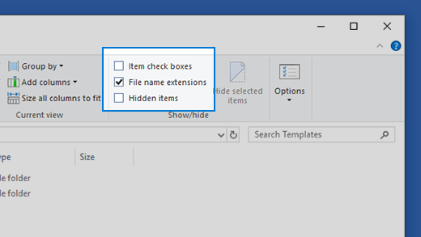
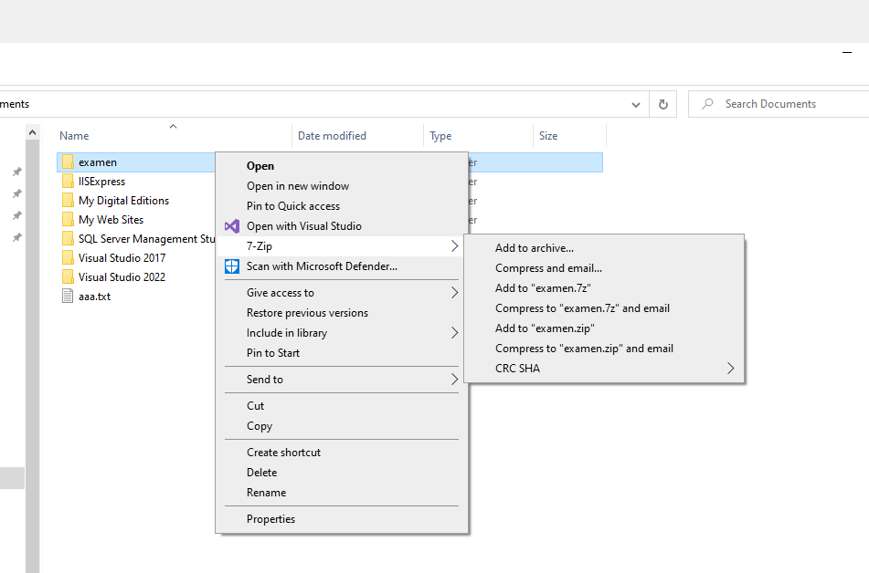
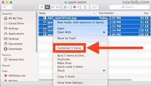
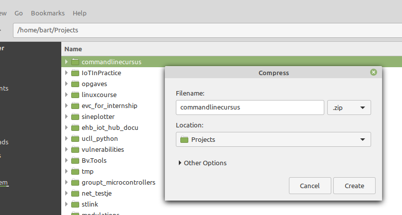
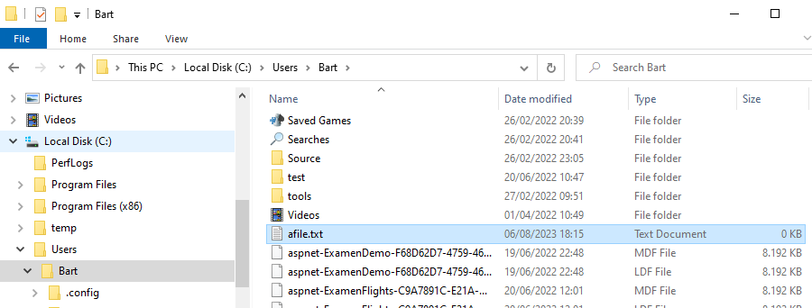
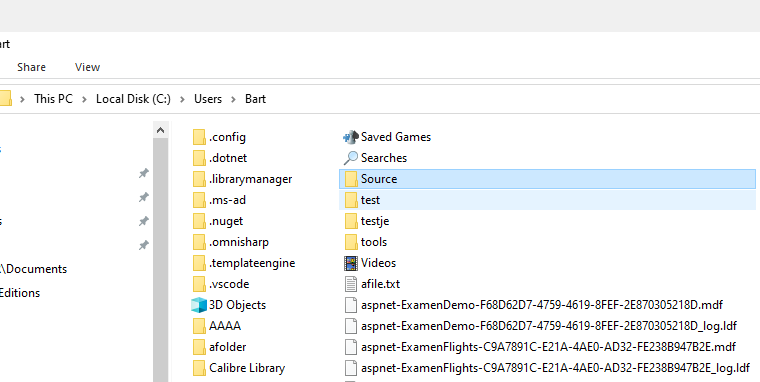
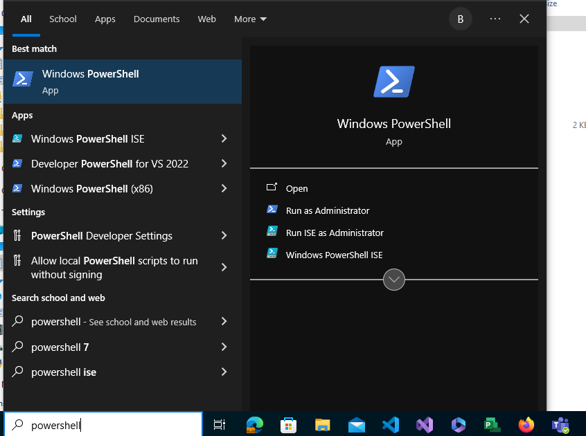
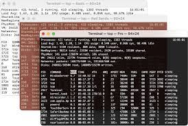

# Files, command line en scripting

## Intro

### Wat is het doel van dit onderdeel?

Binnen deze opleiding gebruik je vele tools die je er voor zorgen dat je direct kan werken met een programmeertaal (C#, Java, Javascript, SQL,...) zonder dat je details hoeft te kennen van het platform waar je mee werkt (Linux, Windows, Mac, ...).

Denk hierbij aan verschillende tools zoals Visual Studio (C#), IntelliJ (Java) of diverse web interfaces zoals de Azure Portal voor devops of om virtuele machines aan te maken.

In de loop van de opleiding zal je soms je ontwikkelplatform (Linux, Windows, Mac, ...) moeten aanspreken om bepaalde problemen op te lossen, denk hier maar aan:

* Zoeken van en binnen logs
* Werken met buildtools zoals dotnet, Maven, Gradle, ...
* Troubleshooten van je applicatie
* Containers om je serverless apps te beheren (Docker)
* Automatiseren van bepaalde taken adhv scripting
* Backups maken
* Platformissues troubleshooten (disk, memory, netwerk, ...)
* ...

In vele (of meeste gevallen) zal je dit moeten doen via een command line interface (Bash, Powershell, ...)

### Aanpak van dit onderdeel

Het is niet mogelijk al deze skills aan te leren in een korte tijd.  
Dit zal binnen de verschillende **andere vakken** worden aangebracht en aangeleerd (afhankelijk van de toepassing).

Dit **opleidingsonderdeel** heeft eerder als doelstelling een **basis** te leggen.  

* Wat zijn Files, folders, ...
* Hoe kanje bepaalde zaken automatiseren met de command line
* Basis command line tools
* ...

### Windows vs *nix

Naast Windows heb je ook andere Unix(like)-besturingssystemen.  
Deze omvatten bijvoorbeeld de vele Linux-distro's (Ubuntu, Fedora, ...), Mac OSx en zelfs Android...

Hoewel een meerderheid van de studenten met Windows als ontwikkelplatform werkt proberen we hier de meeste concepten mee te geven voor deze Unix(like) systemen.  

Niet alleen omdat sommige studenten met zulke platformen werken maar ook gezien de meerderheid van server-applicaties op een Linux-systeem draaien (vandaag de dag ook via containers zoals Docker)

## Files (bestanden) en directories (folders)

We starten met files (of bestanden)

Alle data en programma's op je computer worden bewaard in **files** (of bestanden).  
Denk maar bijvoorbeeld aan de code die je schrijft, word-documenten, database-files, ... maar ook programma's en libraries.  

### Soorten bestanden

#### File-extensions

Een **file extension** is een **suffix**, in de vorm van enkele karakters, aan het **einde** van een **filenaam**.  
Deze extensie geeft aan welk **type bestand** het is en welk **programma** moet worden **gebruikt** om het te openen. 

Het is meestal **gescheiden** van de **bestandsnaam** door een **punt** aan het **einde**, zo zullen **bijvoorbeeld** de **C#-files** waar je met werkt eindigen eindigen op **cs**, bijvoorbeeld 'HelloWorld.cs'.

Zo'n **extensie** zegt dus iets over het **soort van bestand **en wat je besturingsysteem er met doet als je dit bestand opent via een "file explorer".

* Een **.txt** extensie geeft aan dat het een **tekstbestand** is, dat kan worden geopend met Notepad
* Een **.docx** is een **Word-document** dat zal worden geopend met Microsoft Word (of LibreOffice in geval van Linux).
* Een **.jpg** of **.png** extensie duidt een **afbeeldingsbestand** aan, dat kan worden geopend met elk beeldbewerkingsprogramma of viewer, zoals Adobe Photoshop of de standaard foto-viewer van je besturingssysteem.
* Een **.exe** extensie geeft een uitvoerbaar bestand aan in Windows (op Linux meestal zonder een extensie), wat betekent dat het een programma is dat kan worden uitgevoerd.

Het is belangrijk om voorzichtig te zijn bij het wijzigen van een bestandsextensie, omdat dit de manier kan veranderen waarop het besturingssysteem het bestand behandelt.

#### Bestandsextensies tonen (op Windows)

Sommige besturingssystemen verbergen standaard de bestandsextensie voor bekende bestandstypen, maar deze kan meestal worden weergegeven door de **juiste instellingen** te **wijzigen**.  

In Windows doe je door binnen de "file explorer" de optie "Toon extensies" aan te duiden (zie onder)



#### Text vs binaire bestanden

Binnen files maken onderscheid tussen **tekst-bestanden** en **binaire bestanden**.  

Een **tekstbestand** is een type bestand dat **leesbare karakters** of tekst bevat.  
Het is in feite een reeks tekens die door een computer worden opgeslagen als binaire codes, maar die worden geïnterpreteerd als leesbare tekens (zoals letters, cijfers, en symbolen).  

> We hebben dit reeds eerder gezien binnen het hoofdstuk rond "bits en bytes" als we **ASCII** besproken...

Tekstbestanden zijn universeel en kunnen worden geopend door eenvoudige tekstbewerkingsprogramma's zoals notepad (of andere texteditors).  
Voorbeelden van tekstbestanden zijn .txt, .csv, .xml en .json bestanden.

> De code die je schrijft zal ook meestal van dit type zijn (.cs en .java-files bijvoorbeeld)

Een **binair bestand** daarentegen is een bestand dat binaire gegevens bevat, die niet direct **menselijk leesbaar** zijn.  Dit betekent dat de **inhoud** van het **bestand** bestaat uit een of andere vorm van data die door de **computer** op een **specifieke manier** moet worden **geïnterpreteerd**.  
Deze bestanden bevatten vaak meer complexe gegevensstructuren dan simpele tekst, zoals afbeeldingen, audio, video, uitvoerbare programma's, enz. Voorbeelden van binaire bestanden zijn .jpg, .png, .mp3, .exe, enz.

Belangrijk om op te merken is dat terwijl tekstbestanden doorgaans minder complex zijn dan binaire bestanden, ze beperkter zijn in termen van de soorten data die ze kunnen bevatten. Binaire bestanden, hoewel complexer, kunnen een veel breder scala aan data bevatten en representeren.

> De meeste artifacten die je zal deployen (exe, dll, jar, war, ...) zijn binaire bestanden

#### Archieven (zip, rar, ...)

Een speciaal soort file betreft een **archive**.  

Een archive (archief) is een soort van **container-bestand** dat **1 of meerdere bestanden** en/of folders
zal bundelen in 1 bestand.  
Dit maakt het gemakkelijker de bestanden te groeren, transporteren, archiveren, versturen, ...

Daarnaast voorzien deze **archiverings-formaten** meestal (maar niet altijd) een vorm van **compressie**.  
Dit houdt in dat de (totale) grootte (aantal bytes) van de diverse file(s) zal kleiner zijn dan de oorspronkelijke
bestand(en).
De compressie - bij klassieke archieven - zal **lossless** zijn, er zal geen informatie verwijderd worden 
(in tegenstelling bij compressie bij sommige mediabestanden)

Bekende voorbeelden van compressie-formaten zijn **zip**, **rar**, **7zip**, ...  
In onderstaand voorbeeld maak je gebruik van het programma 7zip om een archief aan te maken.



Of op macOS via Finder:



Of op Linux Mint



##### tar.gz

Ook heel populair in server-systemen (zeker op Linux) zijn tar en gunzip.  
Je zal dikwijls files tegenkomen met de extensie **tar.gz**.  

Dat betreft dan een tar-file (bundeling van meerdere files en folders) die 
gecomprimeerd is met gunzip-compressie

### Bestandssystemen (werken met files)

Om deze **bestanden** gemakkelijk te kunnen **terugvinden** op je harde schijf, zorgt je operating system (of besturingssysteem) voor een organisatie van die harde schijf (of andere opslagmedia zoals een SD-card).

Deze hiërarchische organisatie kennen we als een **"file system"** (of bestandssysteem).  
Zo'n "file system" werkt een beetje als een **boomstructuur**.

#### Parent en children

Binnen deze boomstructuur zullen we ook regelmatig verwijzen naar
**children** en **parents** waar **children** **files/directories** die **onder** een 
**parent-folder** vallen.

Als voorbeeld, binnen het path C:\Users\Bart\hello.txt is **hello.txt** een **child** van 
de **parent-folder** Bart die op zijn beurt een **child** is van de **parent-folder Users**

#### Windows

Een **voorbeeld** van zo'n **boomstructuur** in **Windows** zie je hieronder.  

In windows is de root van alle bestanden een harde schrijf.  
Standaard is dit de **C-schijf** maar je kan er meerdere hebben afhankelijk van je computer-setup (D, E, F, ...).

Onder deze harde schijf heb je een aan directories (folders) die op hun beurt andere directories en 
files kan bevatten. Je hebt de harde schijf (C).

~~~
         +---------+
     +---+   C:    +---+
     |   +---------+   |
+----+----+         +--+------+
| System  |   +-----+  Users  +-----+   ...
+---------+   |     +---------+     |
         +----+----+           +----+----+
         |  Bart   |           | Public  |
         +----+----+           +---------+
              |
        +-----+-----+
        | afile.txt |
        +-----------+
~~~

In het voorbeeld hierboven heb je een folder Users, met daaronder een folder Bart en daaronder
een file met de naam afile.txt

In Windows kan je de **file explorer** (or verkenner) gebruiken om deze folders 



#### Linux

In Unix-like systemen zal je in tegenstelling tot Windows geen 
C-schijf (of andere schijven) terugvinden.  

Alles bevindt zicht daar onder de **root-directory**, hier aangeduid
als een **/**

> *Nota:*  
> dit wil niet zeggen dat je niet meerdere harde
> schijven in Unix-systemen kan hebben maar dat is
> buiten scope in de cursus

~~~
           +---------+
     +-----+    /    +---+
     |     +---------+   |
+----+----+           +--+------+
| bin     |     +-----+  home   +-----+    ...
+---------+     |     +---------+     |
           +----+----+           +----+----+
           |  bart   |           |  test   |
           +----+----+           +---------+
                |
          +-----+-----+
          | afile.txt |
          +-----------+

~~~

#### macOS

**macOS** gebruikt grotendeels dezelfde **conventies** als Linux maar er
zijn wel wat verschillen.  

Bijvoorbeeld de home-folders van de gebruikers zullen bijvoorbeeld **niet** onder
**/home** zitten maar onder **/Users**

~~~
           +---------+
     +-----+    /    +---+         
     |     +---------+   |
+----+----+           +--+------+
| bin     |     +-----+  Users  +-----+     ...
+---------+     |     +---------+     |
           +----+----+           +----+----+
           |  bart   |           |  test   |
           +----+----+           +---------+
                |
          +-----+-----+
          | afile.txt |
          +-----------+

~~~

### Filepath (bestandspad)

Elk **onderdeel** van een **filesystem** (**files** en **directories**) kan worden aangeduid met een **(file)path** (of pad).  Hiermee kan je bijvoorbeeld via een "file explorer" navigeren en bestand openen:


Ook vanuit de **programma's die je schrijft** kan je via zo'n **(file)path**
gebruiken om **files** te **lezen** of **manipuleren**.  

Bijvoorbeeld onderstaand C#-sharp programma illustreert dit door een file 
in de homefolder van de user Bart uit de lezen.

~~~cs
foreach (string line in File.ReadAllLines(@"C:\Users\Bart\hello.txt")) {
  Console.WriteLine(line);
}
~~~

Zo'n filepath wordt **hiërarchisch** opgebouwd startende vanaf de **root** van je **filesystem**.  
Dit verschilt wel tussen Windows enerzijds en Linux/macOS anderzijds.  

* Voor Windows start dit een **harde schijf** (**C**, D, ...)
* Voor Linux/Mac start dit van de **root** van je filesystem **voorgesteld** als een **/**

Dan volgende directories en subdirectories die dit path opmaken gescheiden in Windows door een backslash **\\**
en in Linux/Mac door een slash **/**

Voor **bijvoorbeeld** een **file HelloWorld.cs** die zich in de **HOME-directory** van een **user** **student** bevindt is dit

* Voor **Windows** is dit **C:\Users\student\HelloWorld.cs**
* Voor **Linux-distros** is dit **/home/student/HelloWorld.cs**
* Voor **macOS** is dit **/Users/student/HelloWorld.cs**

#### Filepath van HOME-directory

We hebben daarnet naar de home-directory verwezen.  

Het principe is dat elke user - binnen een operating systeem - een toegewezen
directory krijgt die we de HOME-directory noemen.  
In deze folder worden dan typisch automatisch een document-folder, download-folder, media-folders,...
aangemaakt voor 1 specifieke user


Meestal worden deze folders (voor alle users) **gegroepeerd** onder dezelfde **basisfolder**
afhankelijk van het operating system:

* Voor **Windows** onder **C:\Users**
* Voor **Linux-distros** is dit **/home**
* Voor **macOS** is dit **/Users**

Als je dan voor een user - met de naam student - de home-folder zou zoeken is het path:

* Voor **Windows** is dit **C:\Users\student**
* Voor **Linux-distros** is dit **/home/student**
* Voor **macOS** is dit **/Users/student**

#### Let op case-sensitivity

Hou rekening met het feit dat op Windows en Mac paden niet case-sensitive zijn.

* Op Windows zal het path "C:\Users\student" als hetzelfde path worden beschouwd als C:\USERS\STudent"
* Op macOS zal het path "/Users/student" als hetzelfde path worden beschouwd als "/USERS/STudent"

Daarentegen op Linux-distro's zal "/home/student" beschouwd worden als een ander path dan "/home/STUDENT"

### Hidden files

Soms gaat je operating systeem of sommige programma's hidden directories en files aanmaken.  
Deze files hebben meestal als bedoeling dat je als gewone user deze niet gaat zien.  
De conventie (zelfde in de verschillende operating systemen) is de directory of file te laten **starten** met een **punt**
zoals je hieronder ziet.



> Je gaat deze by default in Windows niet altijd zien.  
> Als je deze wil kunnen zien moet je dit in de opties
> van de Windows file explorere aanduiden.

Als **softwareontwikkelaar** is het echter **belangrijk** deze te **kunnen zien** en bewerken
gezien veel van de tools die je zal gebruiken in de opleiding programmeren dit gebruiken:

* nuget (C#) gebruikt .nuget om dependencies
* Maven (Java) gebruikt bijvoorbeeld .m2 voor configuratie en dependencies
* IDE's zoals IntelliJ en Visual Studio voor configuratie
* sleutels en keys om ssh-sessies te kunnen doen (.ssh)
* ...

Als je op een Linux-distro volgend commando uitvoert zal je alle hidden folders
in de home-directory terugvinden...

~~~
bart@bvlegion:~$ ls -ald ~/.*
...
drwxr-xr-x 157 bart bart  12288 Sep 23 10:46 .
drwxr-xr-x   3 root root   4096 Feb 27  2021 ..
drwxrwxr-x   3 bart bart   4096 Dec 26  2021 .anaconda
drwxrwxr-x   5 bart bart   4096 Aug 15 01:42 .android
-rw-rw-r--   1 bart bart    192 Apr  8 21:55 .angular-config.json
drwxrwxr-x   2 bart bart   4096 Mar 28 17:31 .arduino
drwxr-xr-x   6 bart bart   4096 Mar 28 17:44 .arduino15
drwxrwxr-x   7 bart bart   4096 Mar 28 17:44 .arduinoIDE
drwxrwxr-x   4 bart bart   4096 Jan  9  2023 .m2
drwx------   2 bart bart   4096 May 20 18:56 .ssh
drwxr-xr-x   2 bart bart   4096 Aug 21 00:00 .vim
-rw-------   1 bart bart  20056 Sep 22 11:14 .viminfo
...
$ 
~~~

## Werken met een shell?

### Wat is een shell

Een **shell** is een **interactief** **programma** dat rechtstreeks **toegang** heeft tot een
aantal **systeem-utilities** die je via een **text-interface** kan aanspreken om een aantel
low-level **systeem-taken** uit te voeren zoals bijvoorbeeld:

* **Opstarten** van **programma's**
* **Navigeren** door een **file-systeem**
* **Manipuleren** files en folders
* Commando's uitvoeren en programma's starten
* **Controleren** en **monitoren** van **processen**
* **Automatiseren** van taken
* ...

### interactief vs scripting

Bij een shell (Bash, Powershell, ...) heb je 2 operatie-modi:

* **Interactief**: je typt commando, krijgt antwoord van de shell en je kan het volgende commando typen
* **Scripting**: een script dat meerdere commando's bevat wordt uitgevoerd als een programma

### Interactief tekst-commando's ingeven

Een **shell** of **CLI** (command-line-interface) zorgt ervoor dat een gebruiker deze (bovenvermelde) taken kan uitvoeren via **tekst-commando's**.  

In onderstand voorbeeld maak je een directory aan, copieer je een file naar deze directory,
en kijk je na of deze file bestaat.

~~~bash
$ mkdir een_directory
$ cp een_file een_directory/
$ ls een_directory/
een_file
$
~~~

Als gebruiker krijg je telkens na het **uitvoeren** van een **commando** terug
de prompt ter beschikking om het volgende commando uit te voeren.

Ook zullen sommige commando's **feedback** geven, "ls een_directory" zal tonen welke bestanden
in de folder staan.  
Als er een **fout** in de **aanroep** commando staat zal je ook feedback krijgen, hieronder vragen
we bijvoorbeeld de inhoud van een niet bestaande directory op.  
(net zoals een C#-programma een error zal opwerpen als je een getal door 0 deelt...)

~~~bash
$ ls geen_directory/
ls: cannot access 'geen_directory/': No such file or directory
$
~~~

### Commando's uitvoeren via scripting

Naast interactief te werken kan je ook in **scripting-modus** werken.  
Daar heb je geen interactie maar je kan wel **meerdere commando's uitvoeren** **zonder** deze
**interactief** in te geven.

De eerdere tekst-commando's kunnen bijvoorbeeld ook **gebundeld** worden in een **script**.  
(dat je dan kan uitvoeren van een CLI net zoals je programma's kan uitvoeren).   

Zo'n script is een **opeenvolging** van **shell-commandos** die sequentieel worden uitgevoerd (in de volgorde dat ze in het bestand staan).  
In het onderstaande voorbeeld zal eerst het **mkdir-commando** worden uitgevoerd om een directory en dan pas
heb cp-commando (copy) om de file te **copieren**

~~~bash
mkdir een_directory
cp een_file ./een_directory
~~~

In de **meeste shell-omgevingen** is er ook de mogelijkheid om hier wat **programmeer-constructies** aan zo'n
script toe te voegen (**argumenten** meegeven, **variabelen**, **loops**, **condities**, ...).  
Hier komen we **later** nog op **terug**

### Waarom werken met een shell

Om het **kort** te houden, het is een tool die moet gekend zijn als je wil **programmeren** omdat we deze vaardigheden nodig hebben om later met **build tools** (dotnet, maven, gradle, npm, ...) om te gaan, **taken** te **automatiseren**, 
**herhaling** van manuele acties te vermijden, ...  

Elke **softwareontwikkelaar** moet de **beginselen** kennen van het werken met **command-line** binnen de
omgeving waar zij/hij ontwikkeld (dit kan je laptop zijn maar ook een remote omgeving).  
Dit argument is nog sterker als je met **embedded devices** werkt die veelal enkel te besturen zijn via command-line.

## Shell-omgevingen

Een besturingssysteem zal meestal 1 of meerdere omgevingen ondersteunen.  
De meest bekende zijn **Bash** en **Powershell** maar er zijn natuurlijk meerdere...

### Met welke omgeving gaan we nu werken?

Het doel van deze cursus is te focussen op niet 1 maar  op
 **2 shell-omgevingen** te focussen

* **Powershell** op **Windows** (met soms een vergelijking naar CMD)
* **Bash** op **Linux**, **Mac** (e.a. Posix-systemen)

Dit onderdeel zal dus voor deze beide omgevingen de grote lijnen uitleggen:

* Hoe moet je een shell openen?
* Files en directories manipuleren
* Wat zijn de belangrijkste commando's?
* ...

### Dat mag je zelf kiezen

Als **student** mag je zelf de **keuze maken** welke van de 2 je gebruikt
om opdrachten oefeningen te maken...

* Sommige studenten zullen met **Windows** waar de **natuurlijke** **keuze** **Powershell** is.  
* Andere studenten met **Mac** of **Linux** zullen zullen dan weer met **Bash** werken...

> Voor **Windows**-gebruikers is het soms ook aangeraden Bash te gebruiken wegens
> het **veelvuldig** gebruik van **Linux** via **Docker** en/of Windows Subsystem for Linux (**WSL**)

De bedoeling van dit onderdeel is de student **ondersteuning** te **bieden** met tools (in dit geval
command line).  
De keuze is dus aan jou maar je mag vanzelfsprekend ook beide gebruiken...

### Een shell openen in Windows

In **Windows** heb je (sinds Windows 7) heb je **2 versies** van "command line":

* De klassieke **CMD**
* **Powershell**

We geven hieronder even mee hoe je beide kan openen.  
Voor de rest van de cursus gaan we (voor Windows) verder met Powershell (waar van toepassing wijzen we op de verschillen)

#### CMD (legacy)

Afhankelijk van de **Windows-versie** open je via het **menu** (onder "accessoires" of "administrative tools") het programma **CMD**.  
Eenmaal gestart krijg je een **scherm** zoals **hieronder**:  


Deze prompt ```C:\Users\bart>```

* geeft aan welk **path** momenteel is gereferenceerd
* geeft je mogelijkheid om een **commando** in te typen

~~~cmd
C:\Users\Bart>dir                                                             Volume in drive C has no label.                                              Volume Serial Number is EACF-CC93                                                                                                                         Directory of C:\Users\Bart                                                                                                                               25/06/2023  23:44    <DIR>          .                                        25/06/2023  23:44    <DIR>          ..                                       04/03/2022  12:14    <DIR>          .config                                  21/12/2022  21:11    <DIR>          .dotnet                
...
C:\Users\Bart>
~~~

#### Powershell

Om **Powershell** te **openen** navigeer je in het **Windows-menu** naar Powershell



Eenmaal geopend zie je een scherm gelijkaardig aan hieronder.  
Een user-prompt staat open om commando's uit te voeren...


Deze **prompt** ```PS C:\Users\bart>```:

* geeft aan welk **path** momenteel is gereferenceerd
* geeft je mogelijkheid om een **commando** in te typen
* PS geeft aan dat je met powershell werkt (ipv de klassieke CMD-tool)

~~~ps
PS C:\Users\Bart> ls

    Directory: C:\Users\Bart

Mode                 LastWriteTime         Length Name
----                 -------------         ------ ----
d-----          3/4/2022  11:14 AM                .config
d-----        12/21/2022   8:11 PM                .dotnet
...
PS C:\Users\Bart>
~~~

### Linux/Mac shell openen (Bash)

**Linux** en **Mac** hebben verschillende **programma's** waarmee je toegang kan hebben tot de shell.  
In macOS volg je de instructies te https://support.apple.com/nl-be/guide/terminal/apd5265185d-f365-44cb-8b09-71a064a42125/mac om de console te openen.



In Linux hangt het wat af van de distibutie waar je met werkt 
(over het algemeen zullen Linux-gebruikers wel sneller weten hoe een console te openen)


Eenmaal **gestart** krijg je een scherm zoals **hieronder**:  

~~~bash
demo@demohost:~ $
~~~

Deze **prompt** :

* geeft mee welke **user** ingelogd is
* geeft aan welk **path** momenteel is gereferenceerd  
  (in dit geval komt ~ overeen met de home-directory van de user)
* geeft je mogelijkheid om een **commando** in te typen

~~~bash
demo@demohost:~ $ ls -l
total 2196296
-rw-r--r--  1 bart bart 124774783 Feb  6 22:00  01_optional.mp4
-rw-rw-r--  1 bart bart     12811 Aug 21  2022  04.04.28-163.11.eid
-rw-rw-r--  1 bart bart       184 May 29 21:57  1tp.py
drwxrwxr-x  2 bart bart      4096 Oct  4  2022  a
...
~~~

## Operaties op files en directories met een shell

Veel van de **operaties** die je moet uitvoeren op een **command line** zijn 
**fileoperaties**:

* **Aanmaken** en **verwijderen** van **files** en **directories**
* **Navigeren** door een **filesysteem**
* Kopiëren/Verplaatsen van files en directories
* ...

In dit hoofdstuk gaan we deze operaties overlopen.  
Daarnaast gaan we ook even in hoe dat je een "file path" moet gebruiken (relatieve vs absolute paden)

### Een directory aanmaken

Een **eerste** **operatie** is het **aanmaken** van een **directory**.  
Hiervoor gebruik je - zowel in Powershell en Bash - het commando **mkdir**

#### Een directory aanmaken in Powershell

We starten met het aanmaken van een **directory** met het commando **mkdir**

~~~powershell
PS C:\Users\Bart> mkdir een_eerste_directory

    Directory: C:\Users\Bart

Mode                 LastWriteTime         Length Name
----                 -------------         ------ ----
d-----          9/3/2023  10:54 PM                een_eerste_directory

PS C:\Users\Bart>
~~~

Zoals geeft het **mkdir-commando** de feedback dat de folder is aangemaakt.  
Als je nadien het commando **ls** uitvoerd om de inhoud van de working directory te tonen


> Working directory is de directory waar je momenteel op ben gelocaliseerd
> op de console

~~~powershell
PS C:\Users\Bart> ls

    Directory: C:\Users\Bart

Mode                 LastWriteTime         Length Name
----                 -------------         ------ ----

...
d-----          9/3/2023  10:54 PM                een_eerste_directory
...
~~~

Hier zien we in **1 klap 2 commando's**:

* **mkdir** gevolg door het path **een_eerste_directory**  
  Dit maakt een nieuwe folder of directory deze naam.  
* Het commando **ls**  
  Laat ons toe de **inhoud** na te kijken van de huidige **directory**

> Nota: als je via **CMD** werkt ipv powershell zal je **dir** moeten gebruiken **ipv** **ls**

#### Een directory aanmaken in Bash

We starten met het aanmaken van een **directory** via het commando **mkdir**.

~~~bash
demo@demohost ~ $ mkdir een_eerste_directory
demo@demohost ~ $ ls
... een_eerste_directory Documents Games ...
~~~

Hier zien we in 1 klap 2 commando's:

* **mkdir** gevolg door het path **een_eerste_directory**  
  Dit maakt een nieuwe folder of directory deze naam.  
* Het commando **ls**  
  Laat ons toe de **inhoud** na te kijken van de huidige **directory**

### Navigeren door directories

Om te navigeren naar een andere directory maak je - zowel in Powershell, CMD als Bash - gebruik van het commando **cd**, dat staat voor **"change directory"**

#### Navigeren door directories in Powershell

Het gebruik is éénvoudig, je navigeert door **cd** te typen **gevolgd** door het **path** naar deze directory.  
In Powershell doe je dit zoals hieronder om te navigeren naar de directory die we daarnet
hadden aangemaakt:

~~~powershell
PS C:\Users\Bart> cd een_eerste_directory
PS C:\Users\Bart\een_eerste_directory>
~~~

Merk ook dat aan de **prompt** het **nieuwe path** kan zien, in dit geval zijn we ven 
"C:\Users\Bart\" naar "C:\Users\Bart\een_eerste_directory" genavigeerd.

#### pwd en work-directory

Het pad waar je nu in werkt noemen we ook de **"work directory"**.  
Er bestaat trouwens ook het commando **pwd** dat staat voor "print workdirectory".  
Zoals het commando aangeeft zal dit de "work directory" afdrukken waarin je aan het werken bent.

~~~powershell
PS C:\Users\Bart\een_eerste_directory> pwd

Path
----
C:\Users\Bart\een_eerste_directory

PS C:\Users\Bart\een_eerste_directory>
~~~

#### Navigeren door directories in Bash

Als je deze directory hebt aangemaakt kan je hiernaartoe navigeren via het commando **cd**  
(hetgeen staat voor change directory)

~~~bash
demo@demohost ~ $ cd een_eerste_directory
demo@demohost ~/een_eerste_directory $ pwd
/home/bart/een_eerste_directory
demo@demohost ~/een_eerste_directory $
~~~

Het gebruik is éénvoudig, je navigeert door cd te typen gevolgd door het path naar deze directory.  
Het commando **pwd** print in dit geval de gehele huidige directory af.  

### Tab-completions

Tab-completion (of command-line-completion) is een **eigenschap** binnen command line omgevingen
waarbij de console automatisch gedeeltelijk ingevulde commando's en/of paden aanvult.

Als je bijvoorbeeld in de console **mkd** zou typen, gevolgd door tab zal de console voorstellen doen
als er meerdere mogelijkheden bestaan 

~~~bash
$ mkd
mkdir        mkdiskimage  mkdosfs      
$ mkdi
mkdir        mkdiskimage
$
~~~

Als er dan nog slechts 1 commando mogelijk bestaat zal console dit verder aanvullen.

~~~bash
$ cd een_
mkdir        mkdiskimage  mkdosfs      
$ 
mkdir        mkdiskimage
$
~~~

Hetzelfde mechanisme is ook daar bij het invoeren van een path als argument
bij een commando

~~~bash
$ cd een_
een_directory/        een_tweede_directory/ 
$ cd een_directory
~~~

Gezien tab-completion een uitgebreid (maar handig topic) is voor
meer info over tab-completion in Powershell kan je gaan kijken naar:

* Powershell: https://learn.microsoft.com/en-us/powershell/scripting/learn/shell/tab-completion?view=powershell-7.3
* Bash: https://www.gnu.org/software/gnuastro/manual/html_node/Bash-TAB-completion-tutorial.html

### Relatief, absoluut path, ...

**Nu** we **directories** kunnen **aanmaken** en weten welk commando (cd) je moet gebruiken om
te navigeren naar een directory is de moment aangebroken om verder te praten over het concept **path**.

Eerder hebben we vermeld dat filesystemen **hiërarchisch** zijn opgesteld en dat je een **path** kan gebruiken
om een locatie van een **file** of **directory** in dit filesysteem te markeren.

#### Absoluut path

Tot nu spraken we enkel over een **absoluut path**.  
Dat betekent dat je start vanaf de **root** van je **filesystem**:

* Voor Windows is dit een **harde schijf** (**C**, D, ...)
* Voor Linux/Mac start dit van de **root** van je filesystem **voorgesteld** als een **/**

Voor **bijvoorbeeld** een **file HelloWorld.cs** die zich in de **HOME-directory** van een **user** **student** bevindt is dit

* Voor **Windows** is dit **C:\Users\student\HelloWorld.cs**
* Voor **Linux-distros** is dit **/home/student/HelloWorld.cs**
* Voor **macOS** is dit **/Users/student/HelloWorld.cs**

#### Relative path vs Working-directory

Een **relatief path** gaat daarentegen uit van de **huidige locatie** waarin een **programma**, **script** of de **user** zich **bevindt**.  

In deze fase is dit programma onze **terminal/shell-applicatie** waar we shell-commando (cd, mkdir, ...) in uitvoeren.  
Eerder hadden we ook gezien dat het commando **pwd** kunnen gebruiken om deze directory uit te printen

Stel bijvoorbeeld dat je wil navigeren naar een directory die zich binnen je huidige directory
ligt kan je daar naar toe navigeren door gewoon het path in te geven vanuit je work-directory.

Dus bijvoorbeeld ipv met "cd C:\Users\student\een_directory\" te navigeren vanuit je HOME-directory
kan je gewoon "cd .\een_directory" of korter "cd een_directory" gebruiken

#### Parent directory

Als we spreken over een parent directory spreken we over de directory waar jou working-directory
zich bevindt.  
Bijvoorbeeld de parent-directory van "C:\Users\student\een_directory\" is "C:\Users\student\"

Als je nu **relatief** naar een **parent-directory** wil verwijzen kan je dit via de volgende notatie **..**.  
In bovenstaand voorbeeld zou "cd .." je naar "C:\Users\student\" brengen.  

Je kan ook meerdere niveaus hoger, bijvoorbeeld "cd ..\.." brengt je in dat geval naar "C:\Users\"

#### Relatief vs absoluut path in Powershell

*mkdir* en *cd* nemen - net zoals de meeste commando's op de DOS-prompt - als input een **path**.  
Zo'n path is de verwijzing naar een (target-)directory waarop je dit commando wil op uitvoeren.  

Er zijn een aantal manieren waarop je een path kan construeren, het grootste onderscheid dat we hier maken is  absoluut of relatief:

* **absoluut** is een path dat start vanaf de root-directory, dit path start namelijk vanaf de schijf waar je wil naar verwijzen

~~~powershell
PS C:\Users\> cd C:\Users\bart\een_eerste_directory
PS C:\Users\Bart\een_eerste_directory
~~~

Dit start altijd me een verwijzing naar de root-directory (in het geval van Windows is dit een schijf)

* **relatief** verwijst naar een locatie relatief naar je huidige directory

~~~powershell
PS C:\Users\Bart>cd een_eerste_directory
PS C:\Users\Bart\een_eerste_directory>cd ..
PS C:\Users\Bart>cd ..\een_andere_directory
PS C:\Users\een_andere_directory>
~~~

Dit verwijst van je huidige directory naar een path relatief tov je huidige directory.  
Het symbool **..** (2 dots na elkaar) kan je altijd gebruiken om naar de super-directory te verwijzen

#### Relatief vs absoluut path in Bash

**mkdir** en ! nemen - net zoals de meeste commando's op de DOS-prompt - als **input** een **path**.  
Zo'n path is de verwijzing naar een (target-)directory waarop je dit commando wil op uitvoeren.  

Er zijn een aantal manieren waarop je een path kan construeren, het grootste onderscheid dat we hier maken is  absoluut of relatief:

* **absoluut** is een **path** dat **start vanaf** de **root-directory**, dit path start namelijk vanaf de schijf waar je wil naar verwijzen

~~~bash
demo@demohost ~ $ cd /home/bart/een_eerste_directory
demo@demohost ~/een_eerste_directory $ pwd
/home/bart/een_eerste_directory
demo@demohost ~/een_eerste_directory $
~~~

Dit start altijd me een verwijzing naar de root-directory

* **relatief** verwijst naar een locatie relatief naar je huidige directory

~~~bash
demo@demohost ~ $ cd een_eerste_directory
demo@demohost ~/een_eerste_directory $ pwd
/home/bart/een_eerste_directory
demo@demohost ~/een_eerste_directory $ cd ../een_andere_directory
demo@demohost ~/een_andere_directory $
~~~

Dit verwijst van je huidige directory naar een path relatief tov je huidige directory.  
Het symbool **..** (2 dots na elkaar) kan je altijd gebruiken om naar de super-directory te verwijzen

### HOME-directory

Eerder hadden we reeds gezien wat een HOME-directory betekent.  
Binnen de shell-omgevingen kan je hier via een aantal shortcuts naartoe navigeren.

#### Symbool voor HOME-directory

Naast de **.**-symbool - voor de huidige directory - en het **..**-symbool kan je ook direct verwijzen
in een path naar een HOME-directory met het symbool **~**.

Als je **bijvoorbeeld** de inhoud wil kennen van de **HOME-directory** kan je het commando **"ls ~"** gebruiken
zonder het volledige absolute path te gebruiken van de HOME-directory.  
Je kan dit echter ook **combineren** met een **relatief path** om de waarde van een **subdirectory** **binnen** de **HOME-directory** te verwijzen.  

Bijvoorbeeld "ls ~\een_directory" toont de inhoud van deze directory binnen de HOME-directory.

#### HOME-directory in Powershell

Elke user in Windows heeft een home-directory, Windows voorzien een environment-variabele waarmee je terug kan gaan naar deze directory.

~~~powershell
PS C:\Users\Bart>cd C:\
C:\Users> cd ~
PS C:\Users\Bart>
~~~

#### HOME-directory in Bash

Elke user op unix-systemen heeft een home-directory, in bash kan je daarna verwijzen met het teken ~  
Ook cd typen zonder iets zorgt dat je in de home-directory geraakt

~~~bash
demo@demohost ~ $ cd ..
demo@demohost /home $ cd
demo@demohost ~ $ pwd
/home/bart
demo@demohost ~ $ cd ..
demo@demohost /home $ cd ~
demo@demohost ~ $ pwd
/home/bart
demo@demohost ~ $
~~~

### Directories verwijderen

#### Lege directories verwijderen in Windows

Een directory kan verwijderd worden door het commando rmdir.  
Deze directory mag wel geen files bevatten anders zal deze een fout-code opleveren

~~~
PS C:\Users\Bart>rmdir een_eerste_directory

PS C:\Users\Bart>cd een_eerste_directory
The system cannot find the path specified.
~~~

Als je nadien naar deze directory probeert te gaan krijg je een boodschap dat deze directory niet bestaat.

#### (niet lege) Directories verwijderen in Windows

Als een directory niet leeg is echter kan je deze niet zo maar deleten.  
De console zal jou waarschuwen dat de directory niet leeg is en je moet bevestigen/

~~~powershell
PS C:\Users\Bart> rmdir .\een_eerste_directory\

Confirm
The item at C:\Users\Bart\een_eerste_directory\ has children and the Recurse parameter was not specified. If you
continue, all children will be removed with the item. Are you sure you want to continue?
[Y] Yes  [A] Yes to All  [N] No  [L] No to All  [S] Suspend  [?] Help (default is "Y"):
~~~

Je kan dit bevestigen of via rm werken ipv rmdir en de recursive flag meegeven

~~~
PS C:\Users\Bart>rm -r een_eerste_directory

PS C:\Users\Bart>cd een_eerste_directory
The system cannot find the path specified.
~~~

Hier pas je wel best met op gezien je hier ongewild files kan deleten die onder deze 
directory vallen...

#### Lege directories verwijderen in Bash

Een directory kan verwijderd worden door het commando rmdir.  
Deze directory mag wel geen files bevatten anders zal deze een fout-code opleveren

~~~bash
demo@demohost:~$ rmdir een_eerste_directory
demo@demohost:~$ cd een_eerste_directory
bash: cd: een_eerste_directory: No such file or directory
demo@demohost:~$
~~~

Als je nadien naar deze directory probeert te gaan krijg je een boodschap dat deze directory niet bestaat.

#### (niet lege) Directories verwijderen in Bash

Als de directory echter niet leeg is zal **rmdir** dit niet **toelaten** in Bash.  
Dit zal namelijk enkel werken als de directory leeg is.

~~~bash
demo@demohost:~$ rmdir een_eerste_directory/
rmdir: failed to remove 'een_eerste_directory/': Directory not empty
demo@demohost:~$ 
~~~

Indien je dan **toch** de directory **wil verwijderen** gebruik je ipv rmdir het commando
**rm -rf** (waar **r** voor **recursive** staat en **f** voor **force**)

~~~bash
demo@demohost:~$ rm -rf een_eerste_directory/
demo@demohost:~$ ls een_eerste_directory
ls: cannot access 'een_eerste_directory': No such file or directory
demo@demohost:~$
~~~

### Files binnen een directory oplijsten

#### Files binnen een directory in Powershell

We maken opnieuw een directory aan, deze keer navigeren we ook naar deze directory.

~~~powershell
PS C:\Users\Bart>mkdir mijn_eerste_programma
PS C:\Users\Bart>cd mijn_eerste_programma
PS C:\Users\Bart\mijn_eerste_programma>dir
 Volume in drive C is System
 Volume Serial Number is E687-8D34

 Directory of C:\Users\bart\mijn_eerste_programma

02/02/2017  14:15    <DIR>          .
02/02/2017  14:15    <DIR>          ..
               0 File(s)              0 bytes
               2 Dir(s)  123.086.462.976 bytes free
~~~

Vervolgens maken we via een **texteditor** (bijvoorbeeld notepad zoals eerder besproken) aan, en bewaren we dit 
in deze directory

Deze file bewaren we onder de eerder aangemaakte directory onder de naam hello.c.  
Nadien kijken we na met het ls-commando of deze file correct is aangemaakt.  

~~~powershell
PS C:\Users\Bart\mijn_eerste_programma>ls
 Volume in drive C is System
 Volume Serial Number is E687-8D34

 Directory of C:\Users\bart\mijn_eerste_programma

02/02/2017  14:25    <DIR>          .
02/02/2017  14:25    <DIR>          ..
02/02/2017  14:24                77 hello.txt
               2 File(s)            471 bytes
               2 Dir(s)  123.097.833.472 bytes free
~~~

#### Files binnen een directory in Bash

We maken opnieuw een directory aan, deze keer navigeren we ook naar deze directory.

~~~bash
demo@demohost ~ $ cd mijn_eerste_programma/
demo@demohost ~/mijn_eerste_programma $ ls
demo@demohost ~/mijn_eerste_programma $
~~~

Vervolgens maken we via een **texteditor** (bijvoorbeeld gedit zoals eerder besproken) en bewaren
we deze in deze eerder aangemaakte directory

Nadien kijken we na met het ls-commando of deze file correct is aangemaakt.  

~~~bash
demo@demohost ~/mijn_eerste_programma $ ls
hello.code
~~~

### Werken met textfiles op command-line

Om een **textfile** aan te maken, de inhoud te bekijken of bewerken werk je **meestal** vanuit een **teksteditor**.  
Dit kan echter ook vanuit command line op een aantal manieren.

1 van die manieren is werken met **out- en inputstreams**.  
Een process - ofdat nu Windows, Linux of Mac is - heeft altijd een inputstream en meerdere outputstreams.  
Om precies te zijn 1 inputstream die we **standard input** of **STDIN** noemen en minstens 2 outputstreams
die we **standard output** (STDOUT) en **standard error** (STDERR)


~~~
  START PROGRAMMA:       argumenten   
                             |
                             V                        (1)
  (0)                 +------+-----+----> standard output
  standard input ---->|  processs  |  
                      +------+-----+---->  standard error
                             |                        (2)
                             V
  EINDE PROGRAMMA:        exit-code    
~~~

Kort gezegd deze streams stellen de input en output van de console voor.  
Als je bijvoorbeeld een commando ls uitvoert zal daar een **output** aan verbonden zijn zoals je hieronder ziet.  
Deze output kan je in de console opvangen met een aantal operatoren zoals we zo dadelijk gaan zien...

~~~powershell
PS C:\Users\Bart> ls

    Directory: C:\Users\Bart

Mode                 LastWriteTime         Length Name
----                 -------------         ------ ----
d-----          3/4/2022  11:14 AM                .config
d-----        12/21/2022   8:11 PM                .dotnet
d-----         6/19/2022  12:58 AM                .librarymanager
d-----          8/1/2022   8:37 PM                .ms-ad
d-----         3/26/2022   3:17 PM                .nuget
d-----         7/22/2022   7:41 PM                .omnisharp
d-----         6/20/2022  10:44 AM                .templateengine
d-----          3/4/2022  11:00 AM                .vscode
d-r---         2/26/2022   8:39 PM                3D Objects
...
PS C:\Users\Bart> 
~~~

Daarnaast heb je ook een error-stream ingeval je process niet succesvol kan beeindigd worden.  
Dit kan je bijvoorbeeld simuleren door ls uit te voeren met een niet bestaande directory

~~~powershell
PS C:\Users\Bart> ls een_niet_bestaande_directory
ls : Cannot find path 'C:\Users\Bart\een_niet_bestaande_directory' because it does not exist.
At line:1 char:1
+ ls een_niet_bestaande_directory 2> test.txt
+ ~~~~~~~~~~~~~~~~~~~~~~~~~~~~~~~~~~~~~~~~~~~
    + CategoryInfo          : ObjectNotFound: (C:\Users\Bart\e...aande_directory:String) [Get-ChildItem], ItemNotFoundException
    + FullyQualifiedErrorId : PathNotFound,Microsoft.PowerShell.Commands.GetChildItemCommand
PS C:\Users\Bart> 
~~~

#### Binnen een C#-programma

Om het concept van deze streams te linken aan iets dat je
al hebt gezien demonstreren we dit met een programma dat je
zelf kan schrijven binnen de cursus programmeren.

##### SDTIN en STDOUT

In het programma zal Console.WriteLine worden verbonden aan STDOUT
Console.ReadLine daarentegen zal een lijn lezen aan de STDIN die je voorzien


~~~cs
Console.WriteLine("Naam: ");
string naam = Console.ReadLine();
Console.WriteLine($"Je naam is {naam}")
~~~

##### SDTERR

STDERR wordt binnen dotnet-projecten meestal gelinkt aan exceptions of crashes
van je programma's.

Zo zal onderstaand programma crashen Als je bijvoorbeeld onderstaand programma zou aanre

~~~cs
int delenDoor = 0;
Console.WriteLine(5 / delenDoor);
~~~

Als je dit programma uitvoert wordt deze error geredirect naar de STDERR en niet naar de STDERR.  
Hoe je dit verschil kan zien gaan we zo dadelijk zien.

~~~powershell
PS C:\Users\Bart> ConsoleApp4.exe
Unhandled exception. System.DivideByZeroException: Attempted to divide by zero.
   at Program.<Main>$(String[] args) in C:\Users\Bart\Source\Repos\ConsoleApp4\ConsoleApp4\Program.cs:line 2

C:\Users\Bart\ConsoleApp4.exe (process 6236) exited with code -1073741676.
PS C:\Users\Bart> 
~~~

#### Textfiles en redirects in Powershell

##### Redirects in powershell

In Powershell kan je een redirect uitvoeren, dit houdt in dat je de **STDOUT** gaat
omleiden naar een file.

Om dit de te doen gebruik je het >-symbool na het commando.  
In onderstaand voorbeeld gaan we ls gebruiken om de inhoud van de huidige directory
op te vragen:

~~~powershell
PS C:\Users\Bart> ls > inhouddirectory
PS C:\Users\Bart>
~~~

Wat interessant is echter is dat het commando **geen feedback** geeft, dit is omdat
de output (STDOUT) is omgelend naar de file.  
Via het ls-commando kunnen we dit verifieren

~~~
PS C:\Users\Bart> ls .\inhouddirectory
   Directory: C:\Users\Bart  
Mode                 LastWriteTime         Length Name                                                                                                                              
----                 -------------         ------ ----
-a----         9/24/2023  11:54 AM          20720 inhoudfile 
PS C:\Users\Bart>
~~~

##### Inhoud file tonen op de commandline in Powershell

Je kan vanzelfsprekend gaan kijken via de file explorer om
deze file te bekijken maar binnen powershell heb je ook een 
commando om de inhoud van een file te bekijken.

Als je het cat-commando (of type dat ook werkt in de legacy CMD) gebruikt
can je de inhoud van een file naar de STDOUT op de console toveren zoals
je hieronder ziet:

~~~powershell
PS C:\Users\Bart> cat .\inhoudfile

    Directory: C:\Users\Bart

Mode                 LastWriteTime         Length Name
----                 -------------         ------ ----
d-----          3/4/2022  11:14 AM                .config
d-----        12/21/2022   8:11 PM                .dotnet
d-----         6/19/2022  12:58 AM                .librarymanager
d-----          8/1/2022   8:37 PM                .ms-ad
...
PS C:\Users\Bart>
~~~

##### File editen met echo in Powershell

Een handige truc - veel gebruikt in scripting - is het **echo-commando**
gebruiken om **tekst toe te voegen**.

Het echo-commando zorgt ervoor dat je een **stuk tekst** naar de **console**
kan **printen**, **handig** als je een script schrijft en je wil bijvoorbeeld
log-info naar de console schrijven.

In dit geval kan je een redirect kan je dit echter ook gebruiken om een textfile
aan te maken met inhoud

~~~powershell
PS C:\Users\bart\> echo 'hello world' > .\hello.txt
PS C:\Users\bart\> cat .\hello.txt
hello world
PS C:\Users\bart\>
~~~

##### File appenden met echo in Powershell

Een enkele **>** zal telkens de file **overschrijven**!  
Als je een 2de commando zou uitvoeren volgende op vorige commando

~~~powershell
PS C:\Users\bart\> echo 'greetings' > .\hello.txt
PS C:\Users\bart\> cat .\hello.txt
greetings
PS C:\Users\bart\>
~~~

Als je er wil voor zorgen dat deze niet wordt overschreven maar eerder de tekst wil **toevoegen**
gebruiken je een dubbele notatie **>>** zoals je in onderstaand voorbeeld ziet.

~~~powershell
PS C:\Users\bart\> echo 'from bart' >> .\hello.txt
PS C:\Users\bart\> cat .\hello.txt
greetings
from bart
PS C:\Users\bart\>
~~~

#### Textfiles en redirects in Bash

##### Redirects in bash

In Bash kan je een redirect uitvoeren, dit houdt in dat je de **STDOUT** gaat
omleiden naar een file.

Om dit de te doen gebruik je het **>-symbool** na het **commando**.  
In onderstaand voorbeeld gaan we ls gebruiken om de inhoud van de huidige directory
op te vragen:

~~~bash
demo@demohost:~/ $ ls > inhouddirectory
demo@demohost:~/ $
~~~

Wat interessant is echter is dat het commando **geen feedback** geeft, dit is omdat
de output (STDOUT) is omgelend naar de file.  
Via het ls-commando kunnen we dit verifieren

~~~bash
demo@demohost:~/ $ ls ./inhouddirectory
inhoudfile 
demo@demohost:~/ $
~~~

##### Inhoud van een file tonen in Bash

Als je het cat-commando gebruikt
can je de inhoud van een file naar de STDOUT op de console toveren zoals
je hieronder ziet:

~~~bash
demo@demohost:~/ $ cat ./inhouddirectory
 Demo
 Demos
 Desktop
 Development 
demo@demohost:~/ $
~~~

##### File editen met echo in Bash

Een handige truc - veel gebruikt in scripting - is het **echo-commando**
gebruiken om **tekst toe te voegen**.

Het echo-commando zorgt ervoor dat je een **stuk tekst** naar de **console**
kan **printen**, **handig** als je een script schrijft en je wil bijvoorbeeld
log-info naar de console schrijven.

In dit geval kan je een redirect kan je dit echter ook gebruiken om een textfile
aan te maken met inhoud

~~~bash
demo@demohost:~/ $ echo 'hello world' > .\hello.txt
demo@demohost:~/ $ cat .\hello.txt
hello world
demo@demohost:~/ $
~~~

##### File appenden met echo in Powershell

Een enkele **>** zal telkens de file **overschrijven**!  
Als je een 2de commando zou uitvoeren volgende op vorige commando

~~~bash
demo@demohost:~/ $> echo 'greetings' > .\hello.txt
demo@demohost:~/ $ cat .\hello.txt
greetings
demo@demohost:~/ $
~~~

Als je er wil voor zorgen dat deze niet wordt overschreven maar eerder de tekst wil **toevoegen**
gebruiken je een dubbele notatie **>>** zoals je in onderstaand voorbeeld ziet.

~~~bash
demo@demohost:~/ $ echo 'from bart' >> .\hello.txt
demo@demohost:~/ $ cat .\hello.txt
greetings
from bart
demo@demohost:~/ $
~~~

### Copieren van een files

#### Copieren van files in Powershell

Je kan ook een file via de terminal copieren via het commando COPY

~~~powershell
PS C:\Users\Bart\mijn_eerste_programma>copy hello.c hello.txt
        1 file(s) copied.

PS C:\Users\Bart\mijn_eerste_programma>dir
 Volume in drive C is System
 Volume Serial Number is E687-8D34

 Directory of C:\Users\bart\mijn_eerste_programma

02/02/2017  14:34    <DIR>          .
02/02/2017  14:34    <DIR>          ..
02/02/2017  14:24                77 hello.c
02/02/2017  14:24                77 hello.txt
               2 File(s)            154 bytes
               2 Dir(s)  123.095.646.208 bytes free
~~~

#### Copieren van een file in Bash

Je kan ook een file via de terminal copieren via het commando cp

~~~bash
demo@demohost ~/mijn_eerste_programma $ cp hello.c hello.txt
demo@demohost ~/mijn_eerste_programma $ ls
hello.c hello.txt
~~~

### Verwijderen van een file

#### Verwijderen van een file in Powershell

Gezien we deze file niet nodig hebben (voor het vervolg van onze cursus) gaan we deze verwijderen.  
We gebruiken hiervoor het **DEL**-commando op nieuw gevolgd door het path naar deze file.

~~~bat
PS C:\Users\Bart\mijn_eerste_programma>del hello.txt

PS C:\Users\Bart\mijn_eerste_programma>dir
 Volume in drive C is System
 Volume Serial Number is E687-8D34

 Directory of C:\Users\bart\mijn_eerste_programma

02/02/2017  14:35    <DIR>          .
02/02/2017  14:35    <DIR>          ..
02/02/2017  14:24                77 hello.c
               1 File(s)             77 bytes
               2 Dir(s)  123.094.589.440 bytes free

PS C:\Users\Bart\mijn_eerste_programma>
~~~
> **Nota:**  
> Net zoals bij andere commando's kan je een file aanduiden met zowel een relatief als een absoluut path

#### Verwijderen van een file in Bash

Gezien we deze file niet nodig hebben (voor het vervolg van onze cursus) gaan we deze verwijderen.  
We gebruiken hiervoor het **rm**-commando op nieuw gevolgd door het path naar deze file.

~~~bash
demo@demohost ~/mijn_eerste_programma $ ls
hello.c hello.txt
demo@demohost ~/mijn_eerste_programma $ rm hello.txt
demo@demohost ~/mijn_eerste_programma $ ls
hello.c
~~~
> **Nota:**  
> Net zoals bij andere commando's kan je een file aanduiden met zowel een relatief als een absoluut path

## Scripting

Tot nog toe hebben we altijd **interactief** gewerkt met de command line. 

We gebruikten de shell als volgt:

* typt een **commando** na de prompt
* Bash **voert** dit commando **uit** (als je enter hebt gedrukt)
* En **print** de **output** van dit **commando** uit

Een **2de modus** waar je met een shell kan werken is **scripting**.  
Binnen een script kan je 1 of meerdere commando's bundelen en deze kan je dan in 1 maal uitvoeren.

In dit deel gaan we kijken naar hoe we éénvoudige scripten kunnen schrijven om bepaalde zaken te
automatiseren

Dit onderdeel is 2 verdeeld.  
Het eerste deel behandeld Powershell, het 2de Bash.  
Afhangende van jou voorkeur en/of besturingssysteem bekijk je Powershell of Bash

### Powershell scripting

#### Een powershell-script schrijven

Om een **powershell-script** te **schrijven** heb je in principe **niet veel nodig**:

* Een **teksteditor**, eender welke teksteditor (zelfs notepad zou al moeten volstaan)  
  De meest efficiente voor dit soort scripting is echter **Visual Studio Code** (https://code.visualstudio.com/) met
  goede code completion en debugging mogelijkheden
* Een **powershell-console**, normaal gezien standaard geinstalleerd op Windows

> *Bemerking:*
> Powershell is ook installeerbaar op Linux en macOS.  
> Voor deze besturingssystemen wordt echter standaard eerder naar Bash gekeken (zie verder bij Bash-scripting)

#### Een script aanmaken (Hello World)

Om een **powershell-script** aan te maken maak je een nieuwe tekstbestand aan binnen je **teksteditor** (of ide).  
Dit bestand moet **eindigen** met ps1 om automatisch door de interpreter te worden opgepikt.

Als **eerste oefening** maak een betand met de naam **Write-Hello.ps1** aan met onderstaande **content**:

~~~ps1
Write-Host "Hello world"
~~~

#### Een script uitvoeren

Om een **script** **uit te voeren**:

* **Navigeer** je met de **console** naar de **locatie** waar je het **script** hebt opgeslagen
* Je voert het uit door de **naam te typen** voorafgegaan door **.\** zoals hieronder

~~~ps1
PS C:\Users\Bart\pstryout> .\Write-Hello.ps1
Hello World
PS C:\Users\Bart\pstryout>
~~~

Het **punt** **gevolgd** door **backslash** verwijst hier naar het **relatieve path** van het script 
tov je **huidige working work-directory**

Je kan **ook** een **absoluut path** doorgeven als hieronder

~~~ps1
PS C:\Users\> cd ..\..
PS C:\Users\> C:\Users\Bart\pstryout\Write-Hello.ps1
Hello World
PS C:\Users\>
~~~

**Of** een **relatief path** vanuit een **andere directory**

~~~ps1
PS C:\Users\> .\Bart\pstryout\Write-Hello.ps1
Hello World
PS C:\Users\>
~~~

##### Extensie weglaten

Je kan ook de **extensie weglaten** bij het script zoals **hieronder** **gedemonsteerd**...

~~~ps1
PS C:\Users\Bart\pstryout> .\Write-Hello
Hello World
PS C:\Users\Bart\pstryout>
~~~

#### Security!!!

Eén van de zaken waar je dient op te letten (zeker als je een laptop van het bedrijf hebt) is dat **Powershell**
dikwijls is **gedisabled**.  

~~~ps1
PS C:\Users\bartvoe> .\Write-Hello.ps1
.\Write-Hello.ps1 : File C:\Users\bartvoe\Write-Hello.ps1 cannot be loaded because running scripts is disabled
on this system. For more information, see about_Execution_Policies at
https:/go.microsoft.com/fwlink/?LinkID=135170.
At line:1 char:1
+ .\Write-Hello.ps1
+ ~~~~~~~~~~~~~~~~~
    + CategoryInfo          : SecurityError: (:) [], PSSecurityException
    + FullyQualifiedErrorId : UnauthorizedAccess
PS C:\Users\bartvoe>
~~~

Als je dit ziet kan je dit in de setting van Windows gaan aanpassen.  

Zie https://learn.microsoft.com/en-us/powershell/scripting/windows-powershell/starting-windows-powershell?view=powershell-7.3 voor meer informatie.  

Mocht je dit doen met een laptop van je bedrijf kan je hier best vragen aan je administrator...

#### Write-Host command

Powershell ondersteund vele **commands** en **commandlets**.  
De eerste die we hebben gezien is Write-Host (hetzelfde als echo dat we eerder hadden gezien) 
en dient om output naar de console te schrijven vanuit een script:

~~~ps1
Write-Host "Hello world"
~~~

In vele gevallen zijn er trouwens ook klassiek varianten (uit CMD of Bash) ondersteund.  
In dit geval zal **echo** hetzelfde doen als **Write-Host** zoals we eerder hadden gezien...

~~~ps1
echo "Hello world"
~~~

#### Informatie over commando's via  Get-Help

Als je meer over deze commando's kan je naast een google-search binnen de command-line ook altijd gebruik maken van 
de **Get-Help-commandlet**.  
Deze laat je toe om info op te vragen over het commando zelf:

~~~ps1
PS C:\Users\bartvoe\commandlinecursus> Get-Help Write-Host

NAME
    Write-Host
    
SYNTAX
    Write-Host [[-Object] <Object>] [-NoNewline] [-Separator <Object>] [-ForegroundColor {Black | DarkBlue | DarkGreen | DarkCyan | DarkRed | DarkMagenta | 
    DarkYellow | Gray | DarkGray | Blue | Green | Cyan | Red | Magenta | Yellow | White}] [-BackgroundColor {Black | DarkBlue | DarkGreen | DarkCyan | DarkRed | 
    DarkMagenta | DarkYellow | Gray | DarkGray | Blue | Green | Cyan | Red | Magenta | Yellow | White}]  [<CommonParameters>]

ALIASES
    None

REMARKS
    Get-Help cannot find the Help files for this cmdlet on this computer. It is displaying only partial help.
        -- To download and install Help files for the module that includes this cmdlet, use Update-Help.
        -- To view the Help topic for this cmdlet online, type: "Get-Help Write-Host -Online" or
           go to https://go.microsoft.com/fwlink/?LinkID=113426.
PS C:\Users\bartvoe\commandlinecursus>
~~~

Als we bij voorbeeld 1 van de bovenstaande opties - NoNewLine - aan het script toevoegen:

~~~ps1
Write-Host -NoNewLine "Hello world"
~~~

Kunnen we het gedrag van dit command aanpassen zodat het geen nieuwe
lijn afdrukt

~~~ps1
PS C:\Users\Bart\pstryout> .\Write-Hello
Hello WorldPS C:\Users\Bart\pstryout>
~~~

(hetgeen we later in onze scripten kunnen hergebruiken als we meerdere zaken op 1 lijn willen schrijven)


#### Opzoeken van meerdere commando's

~~~
PS C:\Users\bartvoe\commandlinecursus> Get-Help file  
Name                              Category  Module                    Synopsis                                                                                   
----                              --------  ------                    --------                                                                                   
Get-FileHash                      Function  Microsoft.PowerShell.U... ...
Import-PowerShellDataFile         Function  Microsoft.PowerShell.U... ...
New-TemporaryFile                 Function  Microsoft.PowerShell.U... ...
New-PSRoleCapabilityFile          Cmdlet    Microsoft.PowerShell.Core ...                       
...
~~~

#### Commentaar

Net zoals in Java en C#-code kan je ook lijnen in comment zetten.  
In de meeste scripting talen (Powershell, Python, Bash, ...) doe je dit met een hash-teken zoals hieronder

~~~ps1
# Dit is een script...
Write-Host "Hello world" # Na een commando kan ook comment zetten
~~~

Je kan comment op een eigen lijn maar ook achter het commando schrijven.

#### Werken met (naamloze) argumenten/parameters

Aan een script kan je - net zoals een functie uit een programmeertaal - ook argumenten meegeven.  
Dit zorgt er voor dat je scripten hergebruikbaar zijn.

We passen het voorgaande script aan door een argument op te vragen wat het moet afdrukken (ipv het hardgecodeerde HelloWorld).  
Je kan dit doen via de variabele **args**

~~~ps1
# Dit is een script...
Write-Host $args[0] 
~~~

Deze variabele vangt eventuele argumenten op die via de command line worden doorgeven zoals hieronder geillustreerd:

~~~ps1
PS C:\Users\Bart\pstryout> .\Write-Argument.ps1 test
test
PS C:\Users\Bart\pstryout>
~~~

Je kan dit vergelijken met een array (of lijst) uit klassieke programmeertalen.  
Als je argument leeg is zal het programma niet crashen zoals hieronder geillustreerd maar
eerder een lege string teruggeven

~~~ps1
PS C:\Users\Bart\pstryout> .\Write-Argument.ps1

PS C:\Users\Bart\pstryout>
~~~

#### Argumenten met spaties

Argumenten worden van elkaar gescheiden door spaties.  
Dit betekent als je een string meegeeft bestaande uit 2 woorden deze ook als 2 argumenten worden doorgegeven.

~~~ps1
PS C:\Users\Bart\pstryout> .\Write-Argument.ps1 Hello World
Hello
PS C:\Users\Bart\pstryout>
~~~

Als je een string wil meegeven als 1 argument omring je deze best met quotes zoals
hieronder geillustreerd

~~~ps1
PS C:\Users\Bart\pstryout> .\Write-Argument.ps1 "Hello World"
Hello World
PS C:\Users\Bart\pstryout>
~~~

#### Argumenten tellen

Binnen het script kan je ook het aantal argumenten meegeven tellen.  
Dit kan handig zijn als je bijvoorbeeld het gedrag wil veranderen op basis van het aantal argumenten (zie verder voor condities)

~~~ps1
# Dit is een script...
Write-Host $args.count 
~~~

Als je dit uitvoert met onze 2 vorige voorbeelden

~~~ps1
PS C:\Users\Bart\pstryout> .\Write-NumbeOfArguments.ps1 "Hello World"
1
PS C:\Users\Bart\pstryout>  .\Write-NumbeOfArguments.ps1 Hello World
2
PS C:\Users\Bart\pstryout>  
~~~

#### Werken met "named" argumenten/parameters

ipv de $args-lijst te gebruiken kan je de argumenten ook binden aan een
gewone variabele

~~~ps1
param ($param1)
write-host $param1 
~~~

Dit zal zich identiek gedragen aan het werken met de $args-variabele

~~~ps1
PS C:\Users\Bart\pstryout> .\Write-Argument.ps1 "Hello World"
Hello World
PS C:\Users\Bart\pstryout> .\Write-Argument.ps1 Hello World
Hello
PS C:\Users\Bart\pstryout> .\Write-Argument.ps1

PS C:\Users\Bart\pstryout>
~~~

#### Werken met meerder "named" argumenten/parameters

Vanzelfsprekend kan je meerder parameters binden.  
De parameters zullen zich dan binden volgens de positie...

~~~ps1
param ($param1,$param2)
write-host $param1
write-host $param2 
~~~

Met als resultaat:

~~~ps1
PS C:\Users\Bart\pstryout> .\Write-2Arguments.ps1 Hello World
Hello
World
PS C:\Users\Bart\pstryout>
~~~

#### Parameters met types

Je kan deze parameters ook types geven.  
Dit kan zeer handig zijn als je bijvoorbeeld rekenkundige operaties wil uitvoeren.

In powershell kan je de types annoteren door deze te plaatsen voor de definitie (tussen vierkante haken)

~~~ps1
param ([int]$param1,[int]$param2)
write-host ($param1 + $param2)
~~~

> Powershell ondersteunt bijna dezelfde types en operaties als C#

#### Variabelen

De parameters (en de args-array) die we reeds gezien hebben zijn een specifieke soort van variabelen.   
Je kan echter ook - net als in een klassieke programmeertaal - lokale variabelen definieren.  

In het onderstaande voorbeeld gebruiken we een tussenvariabele $result om deze af te drukken

~~~ps1
param ([int]$param1,[int]$param2)
$result = $param1 + $param2
Write-Host $result
~~~

#### Variable-substition binnen strings

Een zeer nuttige en veel gebruikte techniek binnen scripting is het principe
van **variable-substition**.

**ipv** van je string te **concateneren** kan je de variabelen rechtstreeks **includen** 
in de **string**

Als we bijvoorbeeld de **3 parameters** willen **gebruiken** van het vorige script
om een **mooi geformateerd** te bereiken kan je dit toepassen zoals hieronder:

~~~ps1
param ([int]$param1,[int]$param2)

$result = $param1 + $param2
write-host "$param1 + $param2 = $result"
~~~

De parameters worden rechstreeks als variabelen verwezen en expanded in het script.  
Als je dit uitvoert zoals hieronder krijg je een mooiere output

~~~ps1
PS C:\Users\Bart\pstryout> .\Write-Hello 1 2
1 + 2 = 3
PS C:\Users\Bart\pstryout>
~~~

#### Alternatieve schrijfwijze

Je kan ook variabelen aanroepen door deze te **omringen** door **accolades**.  
Dit is - zoals we direct gaan zien - om een **duidelijk** onderscheid te maken met **command** **substitution**

~~~ps1
param ([int]$param1,[int]$param2)
$result = $param1 + $param2
write-host "${param1} + ${param2} = ${result}"
~~~

Met hetzelfde resultaat:

~~~ps1
PS C:\Users\Bart\pstryout> .\Write-Hello 1 2
1 + 2 = 3
PS C:\Users\Bart\pstryout>
~~~

#### Command-substitution

Een **variant** op de voorgaande variable-substitution is **command-substitution**.  
ipv de **inhoud** van een **variabele** te herbruiken, gaat deze de **output** van een **commando** **herbruiken**

~~~ps1
Write-Host "Het is vandaag $(date)"
~~~

Let hierbij op het gebruik van **ronde haakjes** voor **$(date)**
Zoals je **hieronder** ziet zal deze de datum **vandaag** afdrukken

~~~ps1
PS C:\Users\Bart\pstryout> Write-DateOfToday
Het is vandaag 09/12/2023 19:57:52
PS C:\Users\Bart\pstryout>
~~~

Je kan dit trouwens **ook** hergebruiken om een **variabele** te **initializeren**
met de output van een commando:

~~~ps1
$datumVandaag = $(date)
Write-Host "Het is vandaag $datumVandaag"
~~~

#### File manipulatie

Tot nu toe hebben we enkel Write-Host gebruikt maar
in vele gevallen ga je in scripten ook file-manipulaties uitvoeren zoals in het
voorbeeld hieronder

~~~ps1
$fileName = $args[0]
Write-Host "Creatie van een file met de naam ${fileName}.txt"
echo $(date) > "${fileName}.txt"
~~~

Bij het aanroepen van deze file zal je zien dat die dan een fil
aanmaakt met als naam het argument met .txt erna.

~~~powershell
PS C:\Users\Bart\Tmp> .\hello.ps1 test
Creatie van een file met de naam test.txt
PS C:\Users\Bart\Tmp> ls


    Directory: C:\Users\Bart\Tmp


Mode                 LastWriteTime         Length Name
----                 -------------         ------ ----
-a----         9/24/2023   6:57 PM            117 hello.ps1
-a----         9/24/2023   6:57 PM             92 test.txt


PS C:\Users\Bart\Tmp> cat .\test.txt
Sunday, September 24, 2023 6:57:24 PM

PS C:\Users\Bart\Tmp>
~~~

#### Condities

In Powershell kan je ook éénvoudige programmeerlogica inbouwen. 

> We gaan er in dit geval van uit dat je momenteel de onderdelen 
> Programmeren Basis volgt (of gevolgd hebt.)

Een eerste **voorbeeld** is het gebruik van een **if-else-constructie** zoals we
deze kennen vanuit **C#**

~~~ps1
$value = $args[0]
$min = $args[1]
$max = $args[2]

if ($value -gt $max) {
  Write-Host "value $value is greater than $max"
} elseif($value -lt $min) {
  Write-Host "value  $value is smaller than $min"
} else {
  Write-Host "value $value is between $min and $max"
}
~~~

Voor meer info zie https://learn.microsoft.com/en-us/powershell/scripting/learn/deep-dives/everything-about-if?view=powershell-7.3

#### for-loop

~~~ps1
param ([int]$lijnen)
for ($i = 1; $i -le $lijnen; $i++){
    Write-Host $i
}
~~~

#### foreach-loop

~~~ps1
foreach($item in $args){
    Write-Host $item
}
~~~

~~~ps1
[int]$sum = 0
foreach($item in $args){
    sum = $sum + $item
}
Write-Host "Het totaal is $sum"
~~~

#### lijsten

~~~ps1
$list = @('a', 'b', 'c', 'd');

foreach($item in $list){
    Write-Host $item
}
~~~

### Bash-scripting

Waar we op Windows eerder gebruik zullen maken van powershell gebruiken we op Linux en macOS 
typisch gebruik van scripting met Bash.

> Nota:  
> Op Windows kan het ook zijn dat je geconfronteerd wordt met Bash.  
> Zeker met het gebruik van WSL en Docker...

#### Een bash-script maken

Om een bash-script te schrijven heb je enkel een scripteditor en toegang nodig tot een terminal-console (met Bash-interpreter).  
Bash is standaard geinstalleer op Linux en macOS, maar is ook beschikbaar voor Windows.

Een bash-script heeft typisch 2 belangrijke eigenschappen (om te starten), eerst en vooral is het een textfile met de **extensie .sh**
anderzijds dient het te starten met een **shebang**

Als je een **Bash-script** wil schrijven **starten** met de **volgende lijn**.

~~~
#!/bin/bash
~~~

Dit symbool **```#!```** wordt dan ook benoemd als **shebang**.  

Hoewel het buiten de scope valt van deze initiatie, deze shebang is eigen metadata die bepaalt **welke script-interpreter** gebruikt wordt.  
Met onderstaande shebang zal je vragen aan het OS geen bash te gebruiken maar Korn-shell (andere gelijkaardige scripting-engine)

~~~
#!/bin/ksh
~~~

#### Een eerste script

Laten we starten met een "Hello World".  
Hiervoor voegen we 1 lijn toe aan het script

~~~bash
#!/bin/bash

echo "Hello World"
~~~

Als je dit script wil uitvoeren navigeer je naar de directory waar dit script uitgevoerd staat
en type je bash gevolgd door de naam van het script

Dit voert het echo-commando uit dat een string "Hello World" zal printen naar de console.

~~~bash
$ bash hello.sh
Hello World
$
~~~

#### Sequentiele uitvoering

Net als bij andere programmeertalen kan je meerdere commando's achter elkaar plaatsen, deze zullen dan **sequentieel** worden **uitgevoerd**

~~~bash
#!/bin/bash
echo "Hello World"
echo "Je eerste bash-script"
~~~

Beide lijnen worden vervolgens onder elkaar uitgevoerd

~~~bash
$ bash hello.sh
Hello World
Je eerste bash-script
$
~~~

#### Commentaar

Naast het shebang-karakter kan je ook het hash-karakter of **```#```** ook gebruiken als een **comment**-teken (zoals in Python).  
Alles wat je dan schrijft achter dit karakter (op dezelfde lijn) zal dan niet geinterpreteerd worden door de bash-interpreter.

~~~bash
#!/bin/bash
#1ste commando...
echo "Hello World"
#2de commando
echo "Je eerste bash-script"
~~~

#### Bash scripten zijn niet standaard uitvoerbaar

Tot nog toe hebben we het script rechtstreeks door de bash-interpreter laten uitvoeren.

~~~bash
$ bash hello.sh
~~~

Over het algemeen wordt een script echter niet op die manier aangeroepen.  
Net zoals in powershell kan je het script aanroepen door de file rechtstreeks aan te roepen zoals hieronder

~~~bash
bart@CI00166387:~$ ./hello.sh
-bash: ./hello.sh: Permission denied
bart@CI00166387:~$
~~~

De shell geeft echter een foutboodschap, groot probleem!!!  
Waarom is dit => SECURITY

Linux en Unix-systemen zullen over het algemeen scripten niet automatisch als 
uitvoerbaar aanmaken (hetgeen ook logisch is)


#### Permissies

Om dus een script rechtstreeks uitvoerbaar te maken zal je nog een extra stap moeten doen.  
Laten we eerst even kijken naar de permissies via het ls commando (met de optie l)

~~~bash
$ ls -l hello.sh
-rw-r--r-- 1 bart bart 33 Sep 12 23:03 hello.sh
$
~~~

##### read, write, execute

In dit commando zijn de permissies aangeduid als rw-r--r--.  
Wat betekent dit nu eigelijk?

Om te starten heb je standaard 3 soorten rechten:

* r voor read
* w voor write
* x voor execute (uitvoeren)

Het ls commando zal de letter (r,w of x) aanduiden als je het respectievelijke recht hebt en een streep (-) als je het niet hebt.  
Bijvoorbeeld:

* r-- zijn enkel leesrechten
* r-x lees- en uitvoerrechten
* rwx alle rechten
* ... (en alle andere mogelijke combo's)

##### user, group en others

Als we echter goed kijken zien we echter geen 3 symbolen maar 9 in het totaal namelijk rw-r--r--?  
Dit komt omdat me op 3 niveaus rechten kan toekennen:

* user (positie 1 tem 3)  
  De eigenaar van de file
* group (positie 4 tem 6)  
  Iedereen die tot dezelfde groep hoort waartoe deze file behoort
* other (positie 7 tem 9)  
  Iedereen allen

~~~
   user --+  group --+  others --+
          |          |           |
         rw-        r--         r--
~~~

In dit geval heeft:

* De user read en write
* Iedereen anders heeft enkel leesrechten

##### Permissie geven met chmod

Als je dus permissierechten wil toekennen kan je dit via het chmod commando.  

~~~bash
$ ls -l hello.sh
-rw-r--r-- 1 bart bart 33 Sep 12 23:03 hello.sh
~~~

Als je nu het chmod-commando uitvoert:

~~~bash
$ chmod u+x hello.sh
$
~~~

Zie je dat op het user-niveau een x is bijgekomen.

~~~bash
$ ls -l hello.sh
-rwxr--r-- 1 bart bart 33 Sep 12 23:03 hello.sh
$
~~~

Het chmod-commando werkt via de volgend syntax:

~~~
chmod {Wie}{Wat}{Welk} {file|directory}
~~~

* Wie? Target...
  * u => user/owner van deze file
  * g => group waar deze file toe behoort
  * o => others, iedereen verschillend van
  * a of ugo => all, iedereen
* Wat? Toegepast op wie/target
  * + => add => Voeg een permissie toe (voor het target hierboven)
  * - => remove => Neem een permissie af
  * = => set exactly => Zet deze permissie exact (andere permissies worden afgenomen)
* Welke permissies?
  * r => read of leesrecht
  * w => write of schrijfrecht
  * x => execute oftewel recht om uit te voeren als een programma

Het commando chmod u+x hello.sh zal dus aan de user/owner van de file uitvoeringsrechten geven

##### Resultaat

Als gevolg kan je nu het script rechtstreeks aanroepen...

~~~bash
$ ./hello.sh
Hello World
$
~~~

#### Argumenten

Je kan aan zo'n **script** ook **argumenten** meegeven van buitenaf (net zoals we dit eerder bij programma's hebben gezien).  
Binnen dat script kan je naar deze argumenten verwijzen via een **$** gevolgd door het postitionele nummer van het argument

* Het **1ste** argument kan je via **$1** bereiken
* Het 2de via **$2**
* Het 3de via **$3**
* ...

Als je bijvoorbeeld een script maakt als volgt:

~~~bash
#!/bin/bash

echo "Hello $1 $2"
~~~

Dit script zal dan de 1ste en 2de parameter afdrukken met het echo-commando (adhv string-substitutie).

~~~
$ chmod u+x a.sh 
$ ./a.sh 
Hello  
$ ./a.sh a
Hello a 
$ ./a.sh a b
Hello a b
$ ./a.sh a b c
Hello a b
$ 
~~~

#### Speciale argumenten

Naast deze argumenten heb je nog een aantal andere speciale variabelen tot je beschikking:

* **$0** => de naam van het script
* **$#** => aantal argumenten
* **$```@```** => alle argumenten op een rij
* **$```*```** => alle argumenten op een rij als 1 string

Als we deze toevoegen aan voorgaand script...

~~~bash
#!/bin/bash

echo "Hello $1 $2"
echo $0
echo $#
echo $@
echo $*
~~~

... en uitvoert als hieronder

~~~
$ ./hello.sh 1 2 3 4
Hello 1 2
./hello.sh
4
1 2 3 4
1 2 3 4
$ 
~~~

... zien we (na de output van het vorige voorbeeld):

* $0 => ./hello.sh:  
  De naam van het script (./hello.sh) zelf word als argument 0 meegegeven
* $```#``` => 1:  
  Gevolgd door het aantal elementen (4)
* $```@``` => 1 2 3 4:  
  Alle argumenten die aan het script zijn meegegeven (als array)
* $```*``` => 1:  
  Alle argumenten die aan het script zijn meegegeven (als string)

#### Verschil tussen $```@``` en $```*```

Beide $@ en $```*``` zullen alle argumenten opleveren die worden meegegeven aan het script (startende van $1).

Het verschil ligt echter in de details:

* **$```*```** zal deze argumenten voorzien als **1 string**
* **$```@```** daarentegen zal deze argumenten als **array** voorzien

De laatste zal dus gebruikt worden binnen scripten om bijvoorbeeld door de verschillende argumenten te loopen.  
Hier komen we later nog op terug.

Bij ander (niet-script) gebruik zie je verschil enkel als je aan **variable-substitution** doet.  
Als voorbeeld het onderstaande script dat een ls toepast op alle argumenten:

* Bij de 1ste ls gebruken we de array af
* Bij de 2de ls de string-notatie

~~~bash
#!/bin/bash

echo "test 1:"
ls "$@"
echo "test 2:"
ls "$*"
~~~

Als je dan de output bestudeert:

* **$```@```** zal **substitueren** naar **3** aparte **argumenten**
* **$```*```** zal substitueren naar **1 string**

~~~
$ bash ls_test.sh a b c
test 1:
ls: cannot access 'a': No such file or directory
ls: cannot access 'b': No such file or directory
ls: cannot access 'c': No such file or directory
test 2:
ls: cannot access 'a b c': No such file or directory
~~~

#### Condities met if

Bash kan ook gebruikt worden voor complexere logica met loops en condities (zoals Java en C#).  
De structuur van een conditie ziet er als volgt uit:

~~~bash
if [ condition ]
then
  command1
  command2
  ...
  commandn
else
  command1
  command2
  ...
  commandn
fi
~~~

Bijvoorbeeld onderstaande if gaat vergelijken of er argumenten zijn.

~~~bash
if [ $# -eq 0 ]; then
        echo Er zijn geen argumenten.
else
        echo Er zijn wel argumenten.
fi
~~~

Let wel, de condities/expressies - binnen de vierkante haakjes - zijn verschillend van wat we gewoon zijn
van klassieke programmeer talen.

In het bovenstaand voorbeeld maken we gebruiken van -eq om een variabele met een waarde te vergelijken waar
je dat in een andere programmeer taal zoals hieronder geillustreerd.

~~~csharp
int a = 0;
if( a == 0) {
  Console.WriteLine("a is 0");
} else {
  Console.WriteLine("a is niet null 0");
}
~~~

Ook maak je geen gebruik van braces **{}** maar gebruik je **;then** om de start aan te duiden en **fi** om af te sluiten...

##### Testen op getal-waardes

Je kan deze variabelen gaan interpreteren als getallen met de volgende mogelijkheiden:

~~~
INTEGER1 -eq INTEGER2 => INTEGER1 is numeriek gelijk to INTEGER2
INTEGER1 -gt INTEGER2 => INTEGER1 is numeriek groter than INTEGER2
INTEGER1 -lt INTEGER2 => INTEGER1 is numeriek kleiner than INTEGER2
~~~

Bijvoorbeeld als je wil testen of een argument groter is dan een getal:

~~~bash
#!/bin/bash
if [ $1 -gt 100 ]
then
    echo Nummer is groter dan 100.
fi
~~~

##### else if...

In de meeste programmeertalen kan je ook naast else ook een "else if"-clausule toevoegen.  
Deze zal andere alternatieven testen indien de if-clausule niet true evalueert.

~~~bash
#!/bin/bash
if [ $1 -gt 100 ]
then
    echo Nummer is groter dan 100.
elif [ $1 -gt 75 ]
then
    echo Nummer is tussen 76 en 100
elif [ $1 -gt 50 ]
then
    echo Nummer is tussen 51 en 75
else
    echo Nummer is kleiner of gelijk aan 50
fi
~~~

Als we deze testen met wat getallen...

~~~
$ ./hello.sh 101
Nummer is groter dan 100.
$ ./hello.sh 99
Nummer is tussen 76 en 100
$ ./hello.sh 65
Nummer is tussen 51 en 75
$ ./hello.sh 50
Nummer is kleiner of gelijk aan 50
$ 
~~~

##### not/inversie

Je kan je test ook inverteren, als ik bijvoorbeeld het omgekeerde
wil van groter dan 100 kan ik de eigenlijke test inverteren met een uitroepteken.

~~~bash
#!/bin/bash
if [ ! $1 -gt 100 ]
then
    echo Nummer is niet groter dan 100.
else
    echo Nummber is groter dan 100
fi
~~~

Deze mag eventueel ook buiten de haakjes staan

~~~bash
#!/bin/bash
if ! [ $1 -gt 100 ]
then
    echo Nummer is niet groter dan 100.
else
    echo Nummber is groter dan 100
fi
~~~


##### Testen op string-waardes

* Testen op basis van het aantal argumenten

~~~
-n STRING => 	De lengte string > 0.
-z STRING =>	Het betref een lege string.
STRING1 = STRING2 => STRING1 is equal to STRING2
STRING1 != STRING2 =>	STRING1 is not equal to STRING2
~~~

Voorbeelden:

* Nakijken of de string gelijk is

~~~bash
#!/bin/bash
if [ $1 = "go" ]
then
        echo "go"
fi
~~~

~~~bash
#!/bin/bash
if [ -n $1 ]
then
        echo "geen lege string"
fi
~~~

##### File-verificaties

Een 3de manier is deze vergelijkingen te maken als zijn het files

~~~
-e FILE => FILE bestaat.
-d FILE => FILE bestaat en is een directory.
-r FILE => FILE bestaat en de read-permissie is toegekend.
-s FILE => FILE bestaat en is niet leeg.
-w FILE => FILE bestaat en je mag er naar schrijven.
-x FILE => FILE bestaat en heeft execute-permissies.
~~~

Het volgende voorbeeld kijkt na of het argument een file is:

~~~bash
#!/bin/bash
if [ $# -eq 0 ]
then
        echo Er zijn geen argumenten.
else
        echo Er zijn $# argumenten.
        if [ -e $1 ]
        then
                echo Het bestand $1 bestaat.
        else
                echo Het bestand $1 bestaat niet.
        fi
fi
~~~

##### Combinaren met && en ||

Je kan (net zoals in Python) ook combinaties maken

~~~
! EXPRESSION =>	EXPRESSION geinverteerd (false => true)
&& => en
|| => of
~~~

Volgende script gaat het vergelijk maken of een eerste getal 
tussen de 2 andere argumenten ligt

~~~bash
if [ $1 -gt $2 ] && [ $1 -lt $3 ]
then
        echo "$1 ligt tussen  $a en $b"
else
        echo "$1 ligt niet tussen $a en $b"
fi
~~~

Met als volgende gebruik:

~~~
$  ./between.sh 6 5 10
6 ligt tussen  5 en 10
$  ./between.sh 4 5 10
4 ligt niet tussen 5 en 10
$  
~~~

#### for loop

De for-loop kan gebruikt worden om door een lijst te lopen

~~~bash
#!/bin/bash
for i in 1 2 3 4 5 6 7 8 9 10;
do
    echo $i
done 
~~~

Deze lijst kan je ook genereren met het commando **seq**  

~~~
bart@bvlegion:~$ seq 1 10
1
2
3
4
5
6
7
8
9
10
bart@bvlegion:~$
~~~

en als volgt **toepassen** binnen een **script**

~~~bash
#!/bin/bash
for i in $(seq 1 10);
do
    echo $i
done 
~~~

#### while loop

Een andere loop die gaat testen op een conditie.  
Deze heeft het volgende **formaat**:

~~~bash
while [ condition ]
do
   command1
   command2
   command3
done
~~~

Je kan deze bijvoorbeeld gebruiken in **combinatie** met een **teller** en **conditie**:

~~~bash
#!/bin/bash
x=1
while [ $x -le 5 ]
do
  echo "Welcome $x times"
  x=$(( $x + 1 ))
done
~~~

Maar ook om een **oneindige loop** aan te maken:

~~~bash
#!/bin/bash
while true; do
    echo "hello"
    sleep 5
done
~~~


