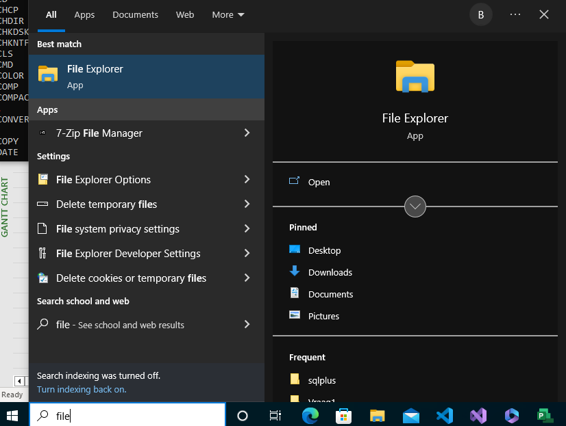
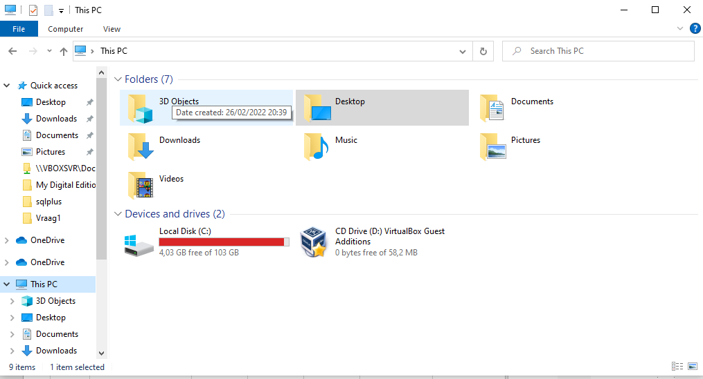
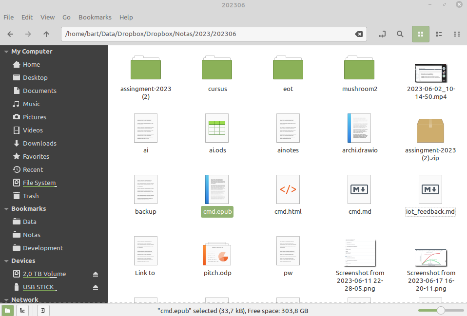
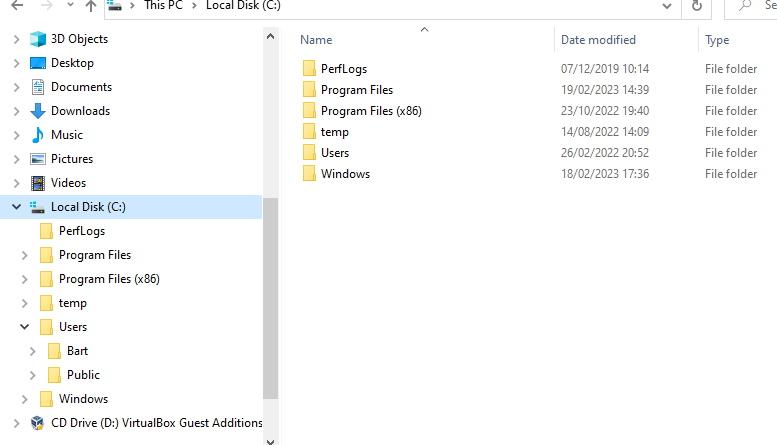
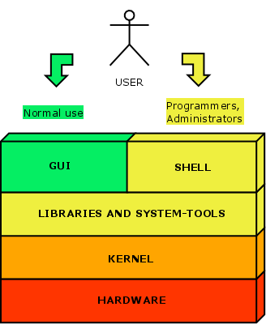

# Files, command line en scripting

Eén van de eerste basis-vaardigheden van een software-ontwikkelaar is het kunnen omgaan met een shell of command-line.  
Het kunnen omgaan met de command-line is meestal noodzakelijk builden en deployen van je software:

* **"Builden"** van je software
* Opladen van de software naar een cloudplatform (of ontwikkelbordje)
* **Automatisatie**, bijvoorbeeld eerste een reeks testen uitvoeren en dan pas opladen naar het platform
* ...

Anderzijds bestaan er veel grafische tools, maar deze steunen in de meeste gevallen op command-line-tools in de achtergrond.  

## Werken met een "File Explorer" (verkenner)

Deze bestanden kan je via een "fileexplorer" bekijken en openen.

### Windows "File Explorer"

De Windows kan je deze openen via het menu:



En kan je via deze explorer navigeren naar directories en bestanden openen



### Linux "File Explorer"

Op Linux heb je - afhankelijk van je distributie - vergelijkbare tools.  
Hieronder zie je op Linux Mint het gebruik van Nemo-fileexplorer



### Mac OSx "File Explorer" (Finder)

Mac OSx gebruik het dan weer het reeds geïnstalleerde **Finder**


## Files en directories (begrippen)

Alle data en programma's op je computer worden bewaard in **files** (of bestanden).  
Denk maar aan je code, documenten, database-files, ... maar ook programma's en libraries.  

### Hierarchische bestandssystemen

Om deze bestanden gemakkelijk te kunnen terugvinden op je harde schijf, zorgt je operating system voor een organisatie van die harde schijf (of andere opslagmedia zoals een SD-card).

Deze hierarchische organisatie kennen we als een bestandssysteem.

#### Filepath

Elke directory heeft een bepaalde path waar je kan navigeren, in het geval van de home-directory is dit hieronder "C:\Users\Bart"


> In Windows Explorer

#### Windows layout

~~~
c:\ ──+
      ├── Program Files
      ├── Program Files (x86)
      ├── Users
            └── student
            └── bart
      ├── System
      ├── System32
      ├── SysWOW64
~~~


#### Linux layout

~~~
/ ──+
    ├── bin -> usr/bin (link)
    ├── boot
    ├── dev
    ├── etc
    └── home
          └── student
          └── bart
    ├── media
    ├── mnt
    ├── opt
    ├── proc
    ├── root
    ├── run
    ├── sbin -> usr/sbin (link)
    ├── srv
    ├── sys
    ├── tmp
    └── usr
        ├── bin
        ├── include
        ├── lib
        ├── local
        └── sbin
    └── var
~~~

#### MacOSx

### File-extensions

### Speciale directories en bestanden

#### HOME-directory


#### Systeem-directories



#### Hidden files

## Werken met een shell?

Een shell is een programma dat rechtstreeks toegang heeft tot een

* Aanmaken/verwijderen/hernoemen/... van een files en foldes
* Starten van programma's



Een shell is (om het simpel te houden) een tool die je een toegang geeft om low-level **systeem-taken** uit te voeren:

* **Opstarten** van **programma's**
* **Navigeren** door een **file-systeem**
* **Manipuleren** files en folders
* **Controleren** en **monitoren** van **processen**
* **Automatiseren** van taken
* ...

### Tekst-commando's ingeven

Een **shell** of **CLI** (command-line-interface) zorgt ervoor dat een gebruiker deze (bovenvermelde) taken kan uitvoeren via **tekst-commando's**.  

Deze tekst-commando's kunnen meestal ook **gebundeld** worden in een **script** (dat je dan kan uitvoeren van een CLI net zoals je programma's kan uitvoeren)   

Nadat zo'n commando/script/programma is uitgevoerd krijgt de gebruiker weer de kans om de shell of het programma aan te spreken door op de opdrachtregel een nieuwe opdracht op te geven.  

#### Structuur van commando's

### Waarom werken met een shell

Om het kort te houden, het is een tool die moet gekend zijn als je wil programmeren omdat we deze vaardigheden nodig hebben om later met toolchains (compiler en linkers) om te gaan.  

Elke softwareontwikkelaar moet de beginselen kennen van het werken met command-line.  
Dit argument is nog sterker als je met embedded devices werkt die veelal enkel te besturen zijn via command-line.

### Vervolg -> Bash en Powershell

We gaan nu dit bekijken voor 2 soorten shell-omgevingen

* Windows CMD
* Bash (Linux, Mac e.a. Posix-systemen)

## Shell-omgevingen

### Een shell openen in Windows

In Windows heb je (sinds Windows 7) 2 versies van "command line":

* De klassieke CMD
* Powershell

We geven hieronder even mee hoe je beide kan openen.  
Voor de rest van de cursus gaan we (voor Windows) verder met Powershell (waar van toepassing wijzen we op de verschillen)

#### CMD (legacy)

Afhankelijk van de Windows-versie open je via het menu (onder "accessoires" of "administrative tools") het programma CMD.  
Eenmaal gestart krijg je een scherm zoals hieronder:  


Deze prompt ```C:\Users\bart>```

* geeft aan welk **path** momenteel is gereferenceerd
* geeft je mogelijkheid om een **commando** in te typen

~~~cmd
C:\Users\Bart>dir                                                             Volume in drive C has no label.                                              Volume Serial Number is EACF-CC93                                                                                                                         Directory of C:\Users\Bart                                                                                                                               25/06/2023  23:44    <DIR>          .                                        25/06/2023  23:44    <DIR>          ..                                       04/03/2022  12:14    <DIR>          .config                                  21/12/2022  21:11    <DIR>          .dotnet                
...
C:\Users\Bart>
~~~

#### Powershell


Deze **prompt** ```PS C:\Users\bart>```:

* geeft aan welk **path** momenteel is gereferenceerd
* geeft je mogelijkheid om een **commando** in te typen
* PS geeft aan dat je met powershell werkt (ipv de klassieke CMD-tool)

### Linux/Mac shell openen (Bash)

Linux en Max hebben verschillende programma's waarmee je toegang kan hebben tot de shell.


Eenmaal gestart krijg je een scherm zoals hieronder:  

~~~bash
demo@demohost ~ $
~~~

Deze **prompt** :

* geeft mee welke **user** ingelogd is
* geeft aan welk **path** momenteel is gereferenceerd  
  (in dit geval komt ~ overeen met de home-directory van de user)
* geeft je mogelijkheid om een **commando** in te typen

## File en directories

### Een directory aanmaken

#### Een directory aanmaken in Powershell

We starten met het aanmaken van een **directory** waarin we onze C-code gaan plaatsen.

~~~powershell
PS C:\Users\Bart> mkdir een_eerste_programma
PS C:\Users\Bart> dir
 Volume in drive C is System
 Volume Serial Number is E687-8D34

 Directory of C:\Users\Bart

...
02/02/2017  14:08    <DIR>          een_eerste_programma
...
~~~

Hier zien we in 1 klap 2 commando's:

* **mkdir** gevolg door het path **een_eerste_programma**  
  Dit maakt een nieuwe folder of directory deze naam.  
* Het commando **dir**  
  Laat ons toe de **inhoud** na te kijken van de huidige **directory**

#### Een directory aanmaken in Bash

We starten met het aanmaken van een **directory** waarin we onze C-code gaan plaatsen.

~~~bash
demo@demohost ~ $ mkdir een_eerste_programma
demo@demohost ~ $ ls
... een_eerste_programma Documents Games ...
~~~

Hier zien we in 1 klap 2 commando's:

* **mkdir** gevolg door het path **een_eerste_programma**  
  Dit maakt een nieuwe folder of directory deze naam.  
* Het commando **ls**  
  Laat ons toe de **inhoud** na te kijken van de huidige **directory**

### Navigeren door directories

#### Navigeren door directories in Powershell

Als je deze directory hebt aangemaakt kan je hiernaartoe navigeren via het commando **cd**  
(hetgeen staat voor change directory)

~~~powershell
PS C:\Users\Bart> cd een_eerste_programma
PS C:\Users\Bart\een_eerste_programma>
~~~

Het gebruik is éénvoudig, je navigeert door cd te typen gevolgd door het path naar deze directory.

#### Navigeren door directories in Bash

Als je deze directory hebt aangemaakt kan je hiernaartoe navigeren via het commando **cd**  
(hetgeen staat voor change directory)

~~~bash
demo@demohost ~ $ cd een_eerste_programma
demo@demohost ~/een_eerste_programma $ pwd
/home/bart/een_eerste_programma
demo@demohost ~/een_eerste_programma $
~~~

Het gebruik is éénvoudig, je navigeert door cd te typen gevolgd door het path naar deze directory.  
Het commando **pwd** print in dit geval de gehele huidige directory af.  

### Relatief vs absoluut path

#### Relatief vs absoluut path in Powershell

*mkdir* en *cd* nemen - net zoals de meeste commando's op de DOS-prompt - als input een **path**.    
Zo'n path is de verwijzing naar een (target-)directory waarop je dit commando wil op uitvoeren.  

Er zijn een aantal manieren waarop je een path kan construeren, het grootste onderscheid dat we hier maken is  absoluut of relatief:

* **absoluut** is een path dat start vanaf de root-directory, dit path start namelijk vanaf de schijf waar je wil naar verwijzen

~~~powershell
PS C:\Users\> cd C:\Users\bart\een_eerste_programma
PS C:\Users\Bart\een_eerste_programma
~~~

Dit start altijd me een verwijzing naar de root-directory (in het geval van Windows is dit een schijf)

* **relatief** verwijst naar een locatie relatief naar je huidige directory

~~~powershell
PS C:\Users\Bart>cd een_eerste_programma
PS C:\Users\Bart\een_eerste_programma>cd ..
PS C:\Users\Bart>cd ..\een_andere_directory
PS C:\Users\een_andere_directory>
~~~

Dit verwijst van je huidige directory naar een path relatief tov je huidige directory.  
Het symbool **..** (2 dots na elkaar) kan je altijd gebruiken om naar de super-directory te verwijzen

#### Relatief vs absoluut path in Bash

*mkdir* en *cd* nemen - net zoals de meeste commando's op de DOS-prompt - als input een **path**.    
Zo'n path is de verwijzing naar een (target-)directory waarop je dit commando wil op uitvoeren.  

Er zijn een aantal manieren waarop je een path kan construeren, het grootste onderscheid dat we hier maken is  absoluut of relatief:

* **absoluut** is een path dat start vanaf de root-directory, dit path start namelijk vanaf de schijf waar je wil naar verwijzen

~~~bash
demo@demohost ~ $ cd /home/bart/een_eerste_programma
demo@demohost ~/een_eerste_programma $ pwd
/home/bart/een_eerste_programma
demo@demohost ~/een_eerste_programma $
~~~

Dit start altijd me een verwijzing naar de root-directory

* **relatief** verwijst naar een locatie relatief naar je huidige directory

~~~bash
demo@demohost ~ $ cd een_eerste_programma
demo@demohost ~/een_eerste_programma $ pwd
/home/bart/een_eerste_programma
demo@demohost ~/een_eerste_programma $ cd ../een_andere_directory
demo@demohost ~/een_andere_directory $
~~~

Dit verwijst van je huidige directory naar een path relatief tov je huidige directory.  
Het symbool **..** (2 dots na elkaar) kan je altijd gebruiken om naar de super-directory te verwijzen

### Home-directory

#### Home-directory in Powershell

Elke user in Windows heeft een home-directory, Windows voorzien een environment-variabele waarmee je terug kan gaan naar deze directory.

~~~powershell
PS C:\Users\Bart>cd C:\
C:\Users> cd %HOMEPATH%
PS C:\Users\Bart>
~~~

#### Home-directory in Bash

Elke user op unix-systemen heeft een home-directory, in bash kan je daarna verwijzen met het teken ~  
Ook cd typen zonder iets zorgt dat je in de home-directory geraakt

~~~bash
demo@demohost ~ $ cd ..
demo@demohost /home $ cd
demo@demohost ~ $ pwd
/home/bart
demo@demohost ~ $ cd ..
demo@demohost /home $ cd ~
demo@demohost ~ $ pwd
/home/bart
demo@demohost ~ $
~~~

### Directories verwijderen

#### Directories verwijderen in Windows

Een directory kan verwijderd worden door het commando rmdir.  
Deze directory mag wel geen files bevatten anders zal deze een fout-code opleveren

~~~
PS C:\Users\Bart>rmdir een_eerste_programma

PS C:\Users\Bart>cd een_eerste_programma
The system cannot find the path specified.
~~~

Als je nadien naar deze directory probeert te gaan krijg je een boodschap dat deze directory niet bestaat.


#### Directories verwijderen in Bash

Een directory kan verwijderd worden door het commando rmdir.  
Deze directory mag wel geen files bevatten anders zal deze een fout-code opleveren

~~~bash
demo@demohost ~ $ rmdir een_eerste_programma
demo@demohost ~ $ cd een_eerste_programma
bash: cd: een_eerste_programma: No such file or directory
~~~

Als je nadien naar deze directory probeert te gaan krijg je een boodschap dat deze directory niet bestaat.

### Files binnen een directory oplijsten

#### Files binnen een directory in Powershell

We maken opnieuw een directory aan, deze keer navigeren we ook naar deze directory.

~~~powershell
PS C:\Users\Bart>mkdir mijn_eerste_programma
PS C:\Users\Bart>cd mijn_eerste_programma
PS C:\Users\Bart\mijn_eerste_programma>dir
 Volume in drive C is System
 Volume Serial Number is E687-8D34

 Directory of C:\Users\bart\mijn_eerste_programma

02/02/2017  14:15    <DIR>          .
02/02/2017  14:15    <DIR>          ..
               0 File(s)              0 bytes
               2 Dir(s)  123.086.462.976 bytes free
~~~

Vervolgens maken we via een **texteditor** (bijvoorbeeld notepad++ zoals eerder besproken) aan, en copieren we volgende inhoud (ons eerste C-programma) naar een file:

~~~c
#include <stdio.h>

int main()
{
	printf("Hello World\n");
	return 0;
}
~~~

Deze file bewaren we onder de eerder aangemaakte directory onder de naam hello.c.  
Nadien kijken we na met het DIR-commando of deze file correct is aangemaakt.  

~~~powershell
PS C:\Users\Bart\mijn_eerste_programma>dir
 Volume in drive C is System
 Volume Serial Number is E687-8D34

 Directory of C:\Users\bart\mijn_eerste_programma

02/02/2017  14:25    <DIR>          .
02/02/2017  14:25    <DIR>          ..
02/02/2017  14:24                77 hello.c
               2 File(s)            471 bytes
               2 Dir(s)  123.097.833.472 bytes free
~~~

#### Files binnen een directory in Bash

We maken opnieuw een directory aan, deze keer navigeren we ook naar deze directory.

~~~bash
demo@demohost ~ $ cd mijn_eerste_programma/
demo@demohost ~/mijn_eerste_programma $ ls
demo@demohost ~/mijn_eerste_programma $
~~~

Vervolgens maken we via een **texteditor** (bijvoorbeeld gedit zoals eerder besproken) aan, en copieren we volgende inhoud (ons eerste C-programma) naar een file:

~~~c
#include <stdio.h>

int main()
{
	printf("Hello World\n");
	return 0;
}
~~~

Deze file bewaren we onder de eerder aangemaakte directory onder de naam hello.c.  
Nadien kijken we na met het ls-commando of deze file correct is aangemaakt.  

~~~bash
demo@demohost ~/mijn_eerste_programma $ ls
hello.code
~~~

### Inhoud van een file tonen op command-line

#### Inhoud van een file tonen op command-line in Powershell

Stel dat je deze file alleen wil lezen bestaat er ook de mogelijkheid vanuit de command-line deze file te lezen.  
Dit kan door de inhoud van deze file naar de command-line af te drukken via het commmando **type**

~~~powershell
PS C:\Users\Bart\mijn_eerste_programma>type hello.c
#include <stdio.h>

int main()
{
        printf("Hello World\n");
        return 0;
}
C:\Users\bart\mijn_eerste_programma>
~~~

#### Inhoud van een file tonen op command-line in Bash

Stel dat je deze file alleen wil lezen bestaat er ook de mogelijkheid vanuit de command-line deze file te lezen.  
Dit kan door de inhoud van deze file naar de command-line af te drukken via het commmando **cat**

~~~bash
demo@demohost ~/mijn_eerste_programma $ cat hello.c
#include <stdio.h>

int main()
{
        printf("Hello World\n");
        return 0;
}
~~~

### Copieren van een files

#### Copieren van files in Powershell

Je kan ook een file via de terminal copieren via het commando COPY

~~~powershell
PS C:\Users\Bart\mijn_eerste_programma>copy hello.c hello.txt
        1 file(s) copied.

PS C:\Users\Bart\mijn_eerste_programma>dir
 Volume in drive C is System
 Volume Serial Number is E687-8D34

 Directory of C:\Users\bart\mijn_eerste_programma

02/02/2017  14:34    <DIR>          .
02/02/2017  14:34    <DIR>          ..
02/02/2017  14:24                77 hello.c
02/02/2017  14:24                77 hello.txt
               2 File(s)            154 bytes
               2 Dir(s)  123.095.646.208 bytes free
~~~

#### Copieren van een file in Bash

Je kan ook een file via de terminal copieren via het commando cp

~~~bash
demo@demohost ~/mijn_eerste_programma $ cp hello.c hello.txt
demo@demohost ~/mijn_eerste_programma $ ls
hello.c hello.txt
~~~

### Verwijderen van een file

#### Verwijderen van een file in Powershell

Gezien we deze file niet nodig hebben (voor het vervolg van onze cursus) gaan we deze verwijderen.  
We gebruiken hiervoor het **DEL**-commando op nieuw gevolgd door het path naar deze file.

~~~bat
PS C:\Users\Bart\mijn_eerste_programma>del hello.txt

PS C:\Users\Bart\mijn_eerste_programma>dir
 Volume in drive C is System
 Volume Serial Number is E687-8D34

 Directory of C:\Users\bart\mijn_eerste_programma

02/02/2017  14:35    <DIR>          .
02/02/2017  14:35    <DIR>          ..
02/02/2017  14:24                77 hello.c
               1 File(s)             77 bytes
               2 Dir(s)  123.094.589.440 bytes free

PS C:\Users\Bart\mijn_eerste_programma>
~~~
> **Nota:**  
> Net zoals bij andere commando's kan je een file aanduiden met zowel een relatief als een absoluut path

#### Verwijderen van een file in Bash

Gezien we deze file niet nodig hebben (voor het vervolg van onze cursus) gaan we deze verwijderen.  
We gebruiken hiervoor het **rm**-commando op nieuw gevolgd door het path naar deze file.

~~~bash
demo@demohost ~/mijn_eerste_programma $ ls
hello.c hello.txt
demo@demohost ~/mijn_eerste_programma $ rm hello.txt
demo@demohost ~/mijn_eerste_programma $ ls
hello.c
~~~
> **Nota:**  
> Net zoals bij andere commando's kan je een file aanduiden met zowel een relatief als een absoluut path

## Uitvoeren van programma's

### Uitvoeren van programma's in Powershell

Naast het bekijken en manipuleren van je file-systeem kan je ook programma's uit voeren.  
Dit doe je door in een directory (waar)

~~~bat
PS C:\Users\Bart>cd mijn_eerste_programma

PS C:\Users\Bart\mijn_eerste_programma>dir
 Volume in drive C is System
 Volume Serial Number is E687-8D34

 Directory of C:\Users\bart\mijn_eerste_programma

02/02/2017  14:35    <DIR>          .
02/02/2017  14:35    <DIR>          ..
02/02/2017  14:24                77 hello.c
02/02/2017  14:24                99 hello
               2 File(s)            176 bytes
               2 Dir(s)  123.094.589.440 bytes free

PS C:\Users\Bart\mijn_eerste_programma>hello
Hello World
~~~

### Uitvoeren van programma's in Bash

Naast het bekijken en manipuleren van je file-systeem kan je ook programma's uit voeren.  
Dit doe je door in een directory (waar)

~~~bash
demo@demohost ~/mijn_eerste_programma $ ls
hello.c hello
demo@demohost ~/mijn_eerste_programma $ ./hello
Hello World
~~~

### Error-levels

#### Error-levels in Powershell

Naast je eigen variabelen houdt je operating systeem ook een aantal variabelen bij.  

~~~powershell
PS C:\Users\Bart\mijn_eerste_programma>cd een_directory_die_niet_bestaat

PS C:\Users\Bart\mijn_eerste_programma>echo %ERROR_LEVEL%
11
~~~

De variabele **ERROR_LEVEL** bijvoorbeeld houdt de error-code van de laatst uitgevoerde applicatie bij.

#### Error-levels in Bash

Naast je eigen variabelen houdt je operating systeem ook een aantal variabelen bij.  

~~~bash
demo@demohost ~ $ cd een_directory_die_niet_bestaat
demo@demohost ~ $ echo $?
1
demo@demohost ~ $ cd mijn_eerste_programma/
demo@demohost ~/mijn_eerste_programma $ echo $?
0
~~~

Deze variabele $? zal de error-code bijhouden die door het laatste programma was teruggegeven aan de shell.  

### Permissies op files en directories

#### Permissies in Powershell

#### Permissies met Bash

## Environment-variabelen

Een shell laat toe om - zoals in een programmmeer-taal - variabelen aan te maken en te gebruiken.

### Een environment-variabele definiëren

#### Een environment-variabele definiëren in Powershell

Een environment-variabele is een variabele (eigenlijk een stuk tekst) die door de shell wordt bijgehouden gedurende de terminal-sessie.  

Het volgende voorbeeld gebruikt bijvoorbeeld dit mechanisme om een het path naar je project bij te houden

~~~powershell
PS C:\Users\Bart\mijn_eerste_programma>set MIJN_PROJECT=C:\Users\bart\mijn_eerste_programma

PS C:\Users\Bart\mijn_eerste_programma>echo MIJN_PROJECT

PS C:\Users\Bart\mijn_eerste_programma>cd C:\

PS C:\> cd %MIJN_PROJECT%

PS C:\Users\Bart\mijn_eerste_programma>
~~~

* Zo'n variabele kan je initialiseren via het keyword **set**
* Gevolgd door de **naam** van deze variabele
* Je kan de inhoud van zo'n **variabele** afdrukken naar de console met het commando **echo** (gevolgd door de naam)
* Je kan de inhoud hergebruiken bij andere commando's door deze naam te omringen door een **%**-terugkomen   
  (de shell zal dan de tekst achter deze variabele vervangen)

> **Let op**, als deze variabele al bestaat dan wordt deze overschreven

#### Een environment-variabele definieren in Bash

Een environment-variabele is een variabele (eigenlijk een stuk tekst) die door de shell wordt bijgehouden gedurende de terminal-sessie.  

Het volgende voorbeeld gebruikt bijvoorbeeld dit mechanisme om een het path naar je project bij te houden

~~~
demo@demohost ~ $ MIJN_PROJECT=/home/bart/mijn_eerste_programma
demo@demohost ~ $ echo $MIJN_PROJECT
/home/bart/mijn_eerste_programma
demo@demohost ~ $ cd $MIJN_PROJECT
demo@demohost ~/mijn_eerste_programma $

~~~

* Zo'n variabele kan je initialiseren via door de **naam** van deze variabele
* Te verbinden via een **=**-teken aan een tekst
* Je kan de inhoud van zo'n **variabele** afdrukken naar de console met het commando **echo**  
  (gevolgd door de naam voorafgegaan door een $-teken)
* Je kan de inhoud hergebruiken bij andere commando's door deze naam te laten voorgaan door een **$**-terugkomen   
  (de shell zal dan de tekst achter deze variabele vervangen)

> **Let op**, als deze variabele al bestaat dan wordt deze overschreven

### Environment-variabelen bekijken

#### Environment-variabelen bekijken in Powershell

Als je alle variabelen willen zien moet je gewoon SET typen

~~~powershell
PS C:\Users\Bart\mijn_eerste_programma>SET
ALLUSERSPROFILE=C:\Documents and Settings\All Users
APPDATA=C:\Documents and Settings\bart\Application Data
CLIENTNAME=Console
CommonProgramFiles=C:\Program Files\Common Files
COMPUTERNAME=V-HJLVYI8TKYLPA
ComSpec=C:\WINDOWS\system32\cmd.exe
FP_NO_HOST_CHECK=NO
HOMEDRIVE=C:
HOMEPATH=\Documents and Settings\bart
KMP_DUPLICATE_LIB_OK=TRUE
LOGONSERVER=\\V-HJLVYI8TKYLPA
MKL_SERIAL=YES
NIEXTCCOMPILERSUPP=C:\Program Files\National Instruments\Shared\ExternalCompi
Support\C\
NUMBER_OF_PROCESSORS=1
OS=Windows_NT
Path=C:\WINDOWS\system32;C:\WINDOWS;C:\WINDOWS\System32\Wbem
PATHEXT=.COM;.EXE;.BAT;.CMD;.VBS;.VBE;.JS;.JSE;.WSF;.WSH;.py;.pyw
PROCESSOR_ARCHITECTURE=x86
PROCESSOR_IDENTIFIER=x86 Family 6 Model 42 Stepping 7, GenuineIntel
PROCESSOR_LEVEL=6
...
~~~

#### Environment-variabelen bekijken in Bash

Als je alle variabelen willen zien moet je gewoon het commando printenv typen

~~~bash
demo@demohost ~/mijn_eerste_programma $ printenv
LC_PAPER=de_BE.UTF-8
XDG_VTNR=8
SSH_AGENT_PID=2713
XDG_SESSION_ID=c1
LC_ADDRESS=de_BE.UTF-8
LC_MONETARY=de_BE.UTF-8
COMP_WORDBREAKS= 	
"'><;|&(:
QT_STYLE_OVERRIDE=gtk
GPG_AGENT_INFO=/home/bart/.gnupg/S.gpg-agent:0:1
TERM=xterm-256color
...
~~~

## Pipes en redirection

### In- en output van programma's

Programma's en scripts hebben meestal in- en output nodig op te kunnen werken.  
Op de command-line zijn er 3 belangrijke elementen

* Input bij de **start** van het **programma**: **argumenten**
* In- en output tijdens de **uitvoering** van het programma: **STDIN, STDOUT en STDERR**
* Output bij het einde van het programma

~~~
START PROGRAMMA:       argumenten   
                           |
                           V                        (1)
(0)                 +------+-----+----> standard output
standard input ---->|  processs  |  
                    +------+-----+---->  standard error
                           |                        (2)
                           V
EINDE PROGRAMMA:       exit-code    
~~~

#### Input bij de start: argumenten (en opties)

Het eerste element hebben we al een aantal maal toegepast bij het gebruiken van diverse commando's.  
Als je en programma aanroept kan je daar namelijk een aantal extra argumenten aan toevoegen.

~~~
START PROGRAMMA:       argumenten   
                           |
                           V      
                    +------+-----+
                    |  processs  |  
                    +------+-----+
~~~

Een voorbeeld:

~~~
student@studentdeb:~$ ls -l hello.sh 
-rwxr--r-- 1 student student 60 Mar 13 20:04 hello.sh
student@studentdeb:~$
~~~

In dit geval is "-l" en "hello.sh" beide argumenten.  

* "-l" in dit geval is optie (een speciaal soort argument voorafgegaan door een koppelteken)
* "hello.sh" als 2de (en eigenlijk) argument

#### Output bij het einde van het programma: Exit-code

Voorgaande was bij de **start** van het programma om eventuele parameter of argumenten door te geven.  

~~~
START PROGRAMMA:       argumenten   
                           |
                           V      
                    +------+-----+
                    |  processs  |  
                    +------+-----+
                           |
                           V
EINDE PROGRAMMA:       exit-code    
~~~

Elke applicatie (binnen linux) zal bij het beeindigen van het programma een code teruggeven.  
Deze code noemen we ook exit-code en heeft als bedoeling informatie mee te geven over het al dan niet successvol uitvoeren van het commando.

Deze commando kan je vanuit de shell opvragen via een speciale variable **$?**.  
Bij normale uitvoering  - **zonder error** of **warnings** - zal deze waarde (bij conventie) **0** zijn.

~~~
student@studentdeb:~$ ls -l hello.sh 
-rwxr--r-- 1 student student 60 Mar 13 20:04 hello.sh
student@studentdeb:~$ echo $?
0
~~~

Als we echter een **foutje** maken bij de uitvoering zal de applicatie (bij conventie) een code opwerpen **verschillend** van **0**  
In onderstaand voorbeeld geven we de naam van een nieu bestaand bestand door aan ls waarop dat deze een exit-code 2 opwerpt.

~~~
student@studentdeb:~$ ls -l hello.sh.not 
ls: cannot access 'hello.sh.not': No such file or directory
student@studentdeb:~$ echo $?
2
student@studentdeb:~$
~~~

Deze code is niet voor elke commando (of zelfs fout binnen een commando) identiek.  
Het 2de voorbeeld - cd naar een niet bestaande directory - bevestigd dit...

~~~
student@studentdeb:~$ cd bestaatniet
bash: cd: bestaatniet: No such file or directory
student@studentdeb:~$ echo $?
1
student@studentdeb:~$ echo $?
0
student@studentdeb:~$ 
~~~

Laatste belangrijke bemerking is dat deze code altijd wordt overschreven, het bevat enkel de exit-code van het laatste commando (ongeacth of deze 0 of verschillend is).  
Bij het volgende commando zal deze terug worden overschreven, in bovenstaand voorbeeld zal de echo zelf de exit-code terug op 0 zetten.

> Nota: als je gewoon een enter drukt zal deze exit-code niet worden overschreven omdat er geen applicatie of commando is uitgevoerd

##### exit-code bij scripts

Vanuit een script kan je trouwens ook de exit-code bepalen.  
Dat kan je via het commando exit gevolgd door een integer (geheel getal)

~~~bash
#!/bin/bash

echo "Hello exit-demo"
exit 25
~~~

Als je dit uitprobeert zie ja dat er inderdaad 25 door het script wordt doorgegeven.

~~~
student@studentdeb:~$ ./exit_code_demo.sh
Hello exit-demo
student@studentdeb:~$ echo $?
25
student@studentdeb:~$ 
~~~

#### Tijdens de uitvoering: stdin, stdout en stderr

Een proces binnen een Linux-distro (maar ook UNIX- en ander POSIX-compliant OS)
heeft altijd automatich **3 files** of **streams** ter beschikking

* **STDIN**: standard input
* **STDOUT**: standard output
* **STDERR**: standard error

Dit zijn datastromen die je een applicatie **"standaard"** zal **doorgeven** (STDOUT en STDERR) aan de **shell**.  
Vanuit de shell echter kan je deze **datastromen** doorgeven aan **andere** **applicaties** via een aantal operatoren (>, >>, <, |)

##### STDOUT

De eerste is STDOUT, dit is de tekst/output dat je applicatie produceert

~~~
START PROGRAMMA:       argumenten   
                           |
                           V                        (1)
                    +------+-----+----> standard output
                    |  processs  |  
                    +------+-----+
                           |
                           V
EINDE PROGRAMMA:       exit-code    
~~~

In onderstaand voorbeeld zal de standard-output van het commando "ls" naar de shell doorsturen

~~~
student@studentdeb:~$ ls -l hello.sh 
-rwxr--r-- 1 student student 60 Mar 13 20:04 hello.sh
student@studentdeb:~$
~~~

##### Redirection operator > (overwrite)

Deze output kan je echter "redirect"-en naar een een file.  
Dit doe je door na het commando een **```>```** teken te plaatsen gevolgd naar welk file je wil schrijven zoals hieronder geillustreerd.

~~~
student@studentdeb:~$ ls -l hello.sh > lsout
student@studentdeb:~$ cat lsout
-rwxr--r-- 1 student student 60 Mar 13 20:04 hello.sh
student@studentdeb:~$
~~~

Een 2de voorbeeld is als je een file wil aanmaken met reeds wat tekst in:

~~~
student@studentdeb:~$ echo "Hello World" > helloworld 
student@studentdeb:~$ cat helloworld
Hello world
student@studentdeb:~$
~~~

##### Redirection operator >> (append)

De >-operator zal een file overschrijven, al er reeds een file bestaat zal deze worden overschreven met de volledige output van het commando.

~~~
student@studentdeb:~$ ls -l hello.sh > lsout
student@studentdeb:~$ cat lsout
-rwxr--r-- 1 student student 60 Mar 13 20:04 hello.sh
student@studentdeb:~$ 
~~~

Als je echter het bestand niet wil overschrijven gebruik je de **>>-redirection-operator**.  
Om te vermijden dat we voorgaande input niet overschrijven gebruiken we deze operator.

~~~
tudent@studentdeb:~$ ls -l hello.sh >> lsout
student@studentdeb:~$ ls -l hello.sh >> lsout
student@studentdeb:~$ cat lsout
-rwxr--r-- 1 student student 60 Mar 13 20:04 hello.sh
-rwxr--r-- 1 student student 60 Mar 13 20:04 hello.sh
-rwxr--r-- 1 student student 60 Mar 13 20:04 hello.sh
student@studentdeb:~$ 
~~~

Als gevolg hiervan zien we dat de file is aangevuld...

##### STDERR

Naast **STDOUT** is er echter nog een **2de** output-stream, namelijk **STDERR**.  

~~~
START PROGRAMMA:       argumenten   
                           |
                           V                        (1)
                    +------+-----+----> standard output
                    |  processs  |  
                    +------+-----+---->  standard error 
                           |                        (2)
                           V
EINDE PROGRAMMA:       exit-code    
~~~

Een **applicatie** zal **foutboodschappen** doorsturen naar de **STDERR**, niet naar **STDOUT**.
Bij volgende voorbeeld proberen we express een nietbestaande file op te lijsten en de outputweg te schrijven naar een file.

~~~
student@studentdeb:~$ ls -l hello.sh.not > lsout
ls: cannot access 'hello.sh.not': No such file or directory
student@studentdeb:~$ cat lsout 
student@studentdeb:~$ 
~~~

Hier zien we dat de **file leeg** is, dit is omdat de enige output van het ls-commando de foutboodschap was die je op de console zag verschijnen.  

##### Redirect van STDERR via 2>

Als je er echter wil voor zorgen dat de **error-output** naar een file wordt weggeschreven kan je dit door een nummer toe te voegen aan het redirect-symbool, voor de **error-stream** is dit altijd **2**

~~~
student@studentdeb:~$ ls -l hello.sh.not 2> lserr
student@studentdeb:~$ cat lserr 
ls: cannot access 'hello.sh.not': No such file or directory
student@studentdeb:~$ 
~~~

Je kan ook zorgen dat **beide** streams **tegelijkertijd** worden weggeschreven.  
In onderstaand voorbeeld:

* lijsten zowel een bestaande als niet bestaande file op
* de error-output gaat naar lserr
* de gewone output gaat naar lsout 

~~~
student@studentdeb:~$ ls -l hello.sh hello.sh.not >lsout 2> lserr
student@studentdeb:~$ cat lserr 
ls: cannot access 'hello.sh.not': No such file or directory
student@studentdeb:~$ cat lsout
-rwxr--r-- 1 student student 60 Mar 13 20:04 hello.sh
student@studentdeb:~$ 
~~~

##### Redirect van beide STDOUT en STDERR via &>

Als je beide tegelijkertijd will redirecten en je **&>** gebruiken in de plaats hiervan.  
In het **voorbeeld** hieronder zullen **beide streams** naar **lsall** worden weggeschreven.

~~~
student@studentdeb:~$ ls -l hello.sh hello.sh.not &> lsall
student@studentdeb:~$ cat lsout 
-rwxr--r-- 1 student student 60 Mar 13 20:04 hello.sh
ls: cannot access 'hello.sh.not': No such file or directory
student@studentdeb:~$ 
~~~

##### STDIN

Een 3de stream is STDIN, dit is de standaard input die een applicatie meekrijgt vanaf de shell.

~~~
START PROGRAMMA:       argumenten   
                           |
                           V                        (1)
(0)                 +------+-----+----> standard output
standard input ---->|  processs  |  
                    +------+-----+---->  standard error
                           |                        (2)
                           V
EINDE PROGRAMMA:       exit-code    
~~~

Om dit de demonstreren gebruiken we het **commando wc**.  
wc is de afkorting voor **wordcount** en geeft (standaard zonder argumenten) 3 outputs:

* Aantal lijnen
* Aantal woorden
* Aantal karakters

Als je dit commando uitvoert zonder argumenten zal dit commando wachten op input van de console,
namelijk STDIN.  
In onderstaand voorbeeld typen we wat tekst gevolgd, om deze tekst (STDIN) te beeindigen gebruiken we "Ctrl + D"

~~~
student@studentdeb:~$ wc
hello
world
greetings from the shell
      3       6      37
student@studentdeb:~$ 
~~~

##### Redirection vanuit een file naar STDIN via <

Net als we met > naar een file kunnen afleiden, kunnen we inhoud van een file afleiden naar STDIN.  
Dit kunnen we via de operator **<**.

We komen terug op ons voorgaand voorbeeld waar we een file aanmaken met 2 lijnen.

~~~
student@studentdeb:~$ ls -l hello.sh hello.sh.not &> lsall
student@studentdeb:~$ cat lsall
ls: cannot access 'hello.sh.not': No such file or directory
-rwxr--r-- 1 student student 60 Mar 13 20:04 hello.sh
~~~

Als we nu de inhoud van deze file willen afleiden naar het wc-commando kunnen we dit doen als hieronder.

~~~
student@studentdeb:~$ wc < lsall
  2  18 114
student@studentdeb:~$ 
~~~

##### Redirection van STDIN/STDOUT vanuit een ander process/commando naar STDIN via |

In bovenstaand voorbeeld werkten we nog altijd met een tussenfile - lsall - om de output
van het ls-commando te verbinden aan het wc-commando.

Er is echter een operator die de output-stream van het ene commando (ls) men de inputstream van het andere commando (wc).  
Om dit te doen moet een pipe-opetor of | tussen beide commando's plaatsen zoals hieronder geillustreerd.

~~~
bart@studentdeb:~$ ls -l hello.sh hello.sh.not | wc
ls: cannot access 'hello.sh.not': No such file or directory
      1       9      52
bart@studentdeb:~$
~~~

Bemerk hier wel dat deze pipe-operator enkel de stderror verbindt met de stdin.

~~~
            STDOUT    |    STDIN   STDOUT     CONSOLE:
    +------+-----+-------->+------+-----+---->  1       9      52 
    |  ls -l ... |         |     WC     |
    +------+-----+         +------+-----+
~~~


##### Redirection vanuit een ander process/commando naar STDIN via |&

Wil je toch beide proberen dan dien je dit te doen met een variant van de pike-operator die beide **STDERR en STDIN cobmineert**, namelijk **|&**

~~~
bart@studentdeb:~$ ls -l hello.sh hello.sh.not |& wc
      2      18     112
bart@studentdeb:~$ 
~~~

Met deze operator worden zowel de STDOUT als de STDERR bij elkaar gevoegd
en doorgegeven aan de STDIN van WC.

~~~
            STDOUT  |&      STDIN   STDOUT     CONSOLE:
    +------+-----+---+----->+------+-----+---->  2      18     112 
    |  ls -l ... |   |      |     WC     |
    +------+-----+---+      +------+-----+
            STDERR
~~~


## Top 10 commando's

### Powershell

### Bash

## Scripting

### Powershell scripting

### Bash-scripting

Tot nog toe hebben we altijd **interactief** gewerkt met Bash.  
Je

* typt een **commando** na de prompt
* Bash **voert** dit commando **uit** (als je enter hebt gedrukt)
* En **print** de **output** van dit **commando** uit

Een **2de modus** waar je met een shell kan werken is **scripting**.  
Binnen een script kan je 1 of meerdere commando's bundelen en deze kan je dan in 1 maal uitvoeren.

#### shebang

Als je een **Bash-script** wil schrijven dient dit altijd te **starten** met de **volgende lijn**.

~~~
#!/bin/bash
~~~

We noemen het symbool **```#!```** ook wel een **shebang**, deze bepaalt **welke script-interpreter** gebruikt wordt.  
Vervolgens kan je daaronder dan commando's plaatsen, deze zullen dan **sequentieel** worden **uitgevoerd**

~~~bash
#!/bin/bash
echo "Hello World"
echo "Het is vandaag $(date)"
~~~

#### Commentaar

Naast het shebang-karakter kan je ook het hash-karakter of **```#```** gebruiken als een comment-teken (zoals in Python).  
Alles wat je dan schrijft achter dit karakter (op dezelfde lijn) zal dan niet geinterpreteerd worden door de bash-interpreter.

~~~bash
#!/bin/bash
#1ste commando...
echo "Hello World"
#2de commando
echo "Het is vandaag $(date)"
~~~

#### Uitvoeren met de bash-interpreter

**Bewaar** dit als **hello.sh** en voer deze uit als **volgt**:

~~~
student@studentdeb:~$ bash ./hello.sh 
Hello World
Het is vandaag Wed 15 Dec 2021 03:24:45 PM CET
student@studentdeb:~$ 
~~~

Beide lijnen worden 1 na 1 uitgevoerd???

#### Uitvoeren als programma (en permissies)

Je kan het **script** ook **uitvoeren** net zoals je een gewoon **programma/commando** uitvoert.  
Om dat te kunnen doen dien je echter nog een extra stap te doen want...

~~~
student@studentdeb:~$ ./hello.sh
bash: ./hello.sh: No such file or directory
student@studentdeb:~$ bash ./hello.sh 
~~~

...een **script** wordt **by default niet uitvoerbaar** gemaakt zoals je hieronder ziet.  

~~~
student@studentdeb:~$ ls -l ./hello.sh
-rw-r--r-- 1 student student 61 Dec 15 15:24 ./hello.sh
~~~

Om het het script zo uit te voeren dien je echter de **permissies** te **wijzigen** dit doe je met het **chmod-commando**:

~~~
student@studentdeb:~$ chmod u+x hello.sh
student@studentdeb:~$ ls -l ./hello.sh
-rwxr--r-- 1 student student 61 Dec 15 15:24 ./hello.sh
student@studentdeb:~$
~~~

ls -l toont dat je het script nu kan uitvoeren door de x (in rwx) en dus **kan** je het En kan je het script uitvoeren. uitvoeren.

> *Geduld:*
> De **uitleg** rond **permissies** **volgt** in het hoofdstuk rond permissies...

~~~
student@studentdeb:~$ ls -l ./hello.sh
-rwxr--r-- 1 student student 61 Dec 15 15:24 ./hello.sh
student@studentdeb:~$ ./hello.sh 
Hello World
Het is vandaag Wed 15 Dec 2021 03:28:37 PM CET
student@studentdeb:~$
~~~

#### Argumenten

Je kan aan zo'n **script** ook **argumenten** meegeven van buitenaf (net zoals we dit eerder bij programma's hebben gezien).  
Binnen dat script kan je naar deze argumenten verwijzen via een **$** gevolgd door het postitionele nummer van het argument

* Het **1ste** argument kan je via **$1** bereiken
* Het 2de via **$2**
* Het 3de via **$3**
* ...

Als je bijvoorbeeld een script maakt als volgt:

~~~bash
#!/bin/bash

echo "Hello $1 $2"
~~~

Dit script zal dan de 1ste en 2de parameter afdrukken met het echo-commando (adhv string-substitutie).

~~~
student@studentdeb:~$ chmod u+x a.sh 
student@studentdeb:~$ ./a.sh 
Hello  
student@studentdeb:~$ ./a.sh a
Hello a 
student@studentdeb:~$ ./a.sh a b
Hello a b
student@studentdeb:~$ ./a.sh a b c
Hello a b
student@studentdeb:~$ 
~~~

#### Speciale argumenten

Naast deze argumenten heb je nog een aantal andere speciale variabelen tot je beschikking:

* **$0** => de naam van het script
* **$#** => aantal argumenten
* **$```@```** => alle argumenten op een rij
* **$```*```** => alle argumenten op een rij als 1 string

Als we deze toevoegen aan voorgaand script...

~~~bash
#!/bin/bash

echo "Hello $1 $2"
echo $0
echo $#
echo $@
echo $*
~~~

... en uitvoert als hieronder

~~~
student@studentdeb:~$ $ bash ./hello.sh 1 2 3 4
Hello 1 2
./hello.sh
4
1 2 3 4
1 2 3 4
student@studentdeb:~$ 
~~~

... zien we (na de output van het vorige voorbeeld):

* $0 => ./hello.sh:  
  De naam van het script (./hello.sh) zelf word als argument 0 meegegeven
* $```#``` => 1:  
  Gevolgd door het aantal elementen (4)
* $```@``` => 1 2 3 4:  
  Alle argumenten die aan het script zijn meegegeven (als array)
* $```*``` => 1:  
  Alle argumenten die aan het script zijn meegegeven (als string)

#### Verschil tussen $```@``` en $```*```

Beide $@ en $```*``` zullen alle argumenten opleveren die worden meegegeven aan het script (startende van $1).

Het verschil ligt echter in de details:

* **$```*```** zal deze argumenten voorzien als **1 string**
* **$```@```** daarentegen zal deze argumenten als **array** voorzien

De laatste zal dus gebruikt worden binnen scripten om bijvoorbeeld door de verschillende argumenten te loopen.  
Hier komen we later nog op terug.

Bij ander (niet-script) gebruik zie je verschil enkel als je aan **variable-substitution** doet.  
Als voorbeeld het onderstaande script dat een ls toepast op alle argumenten:

* Bij de 1ste ls gebruken we de array af
* Bij de 2de ls de string-notatie

~~~bash
#!/bin/bash

echo "test 1:"
ls "$@"
echo "test 2:"
ls "$*"
~~~

Als je dan de output bestudeert:

* **$```@```** zal **substitueren** naar **3** aparte **argumenten**
* **$```*```** zal substitueren naar **1 string**

~~~
$ bash ls_test.sh a b c
test 1:
ls: cannot access 'a': No such file or directory
ls: cannot access 'b': No such file or directory
ls: cannot access 'c': No such file or directory
test 2:
ls: cannot access 'a b c': No such file or directory
~~~


